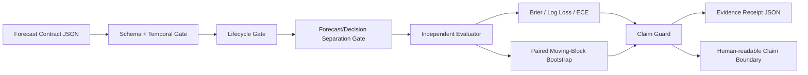

# World 8 Evidence Auditor

**AI Builders Hackathon 2026 — new project implementation**

Status: BUILDING / PUBLIC SOURCE / NO LIVE TRADING
Started: 2026-08-27

World 8 Evidence Auditor is a browser-based audit tool for probabilistic multi-agent forecasting systems. It accepts Forecast Contract records, validates temporal/lifecycle boundaries, measures forecast quality, runs a paired moving-block bootstrap, and generates a machine-readable claim-safety receipt.

The product is built around one rule:

> A system should not be allowed to say more than its evidence supports.

## What it audits

- `data_cutoff_at <= issued_at <= valid_from < resolved_at`
- lifecycle/target consistency
- probability bounds
- Forecast vs Decision/Order field separation
- Brier score
- log loss
- expected calibration error (ECE-10)
- candidate-vs-baseline paired loss deltas
- deterministic moving-block bootstrap confidence intervals
- claim classification:
  - `SUPPORTED_IMPROVEMENT`
  - `INCONCLUSIVE`
  - `SUPPORTED_WORSENING`
- downloadable evidence/claim receipt

## Why this is useful

Agent demos often collapse prediction, policy, and execution into one output and then report only favorable outcomes. Evidence Auditor makes the forecast object independently measurable and forces positive, negative, and inconclusive results to be represented differently.

## Live demo

Deployment target:
`https://huggingface.co/spaces/Saeedfa/world8-evidence-auditor`

Status: PENDING DEPLOYMENT

## Run locally

No build step or backend is required.

```bash
python -m http.server 8000
```

Then open:

`http://localhost:8000/ai-builders-2026/world8-evidence-auditor/`

For tests:

```bash
cd ai-builders-2026/world8-evidence-auditor
node --test tests/auditor.test.mjs
```

Requires Node.js 20+ only for tests. The browser product itself has no npm runtime dependency.

## Architecture



## Hackathon disclosure

The World 8 architecture, its v0.1.0 software release, and the frozen market-replay research pre-date this hackathon project and are **not** claimed as new hackathon work.

The Evidence Auditor product implementation in this directory — UI, contract audit engine, bootstrap evaluator, claim guard, samples, tests, and its dedicated live demo — is new work started during the AI Builders Hackathon period.

See `PREEXISTING_DISCLOSURE.md`.

## Public research references

- World 8 v0.1.0 Zenodo DOI: https://doi.org/10.5281/zenodo.22127650
- World 8 evidence demo: https://huggingface.co/spaces/Saeedfa/world8-demo
- Hugging Face collection: https://huggingface.co/collections/Saeedfa/world-8-6a902b1a3a05b0ab39990265

## Safety / evidence boundary

This tool is for research/evaluation. It does not place orders, connect to brokerage/exchange accounts, deploy capital, or claim profitability.

## License

Hackathon project code in this directory is released under the MIT License; see `LICENSE`.
