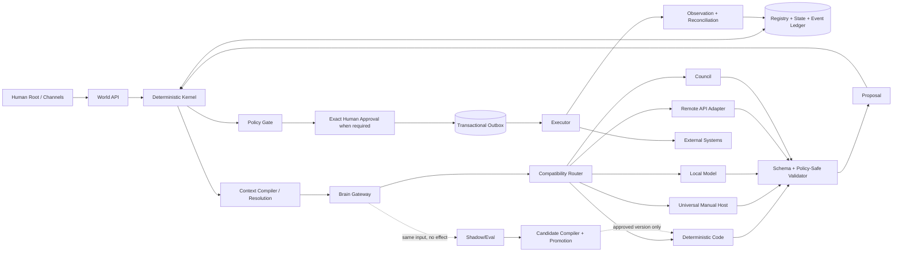
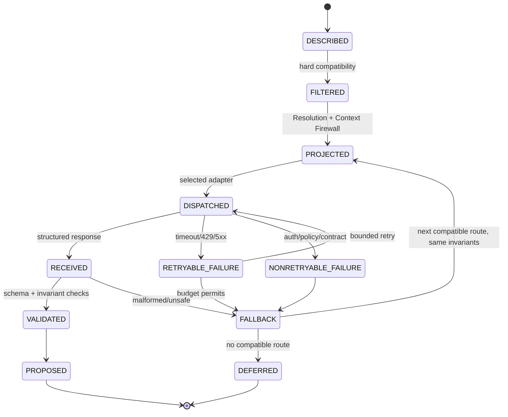
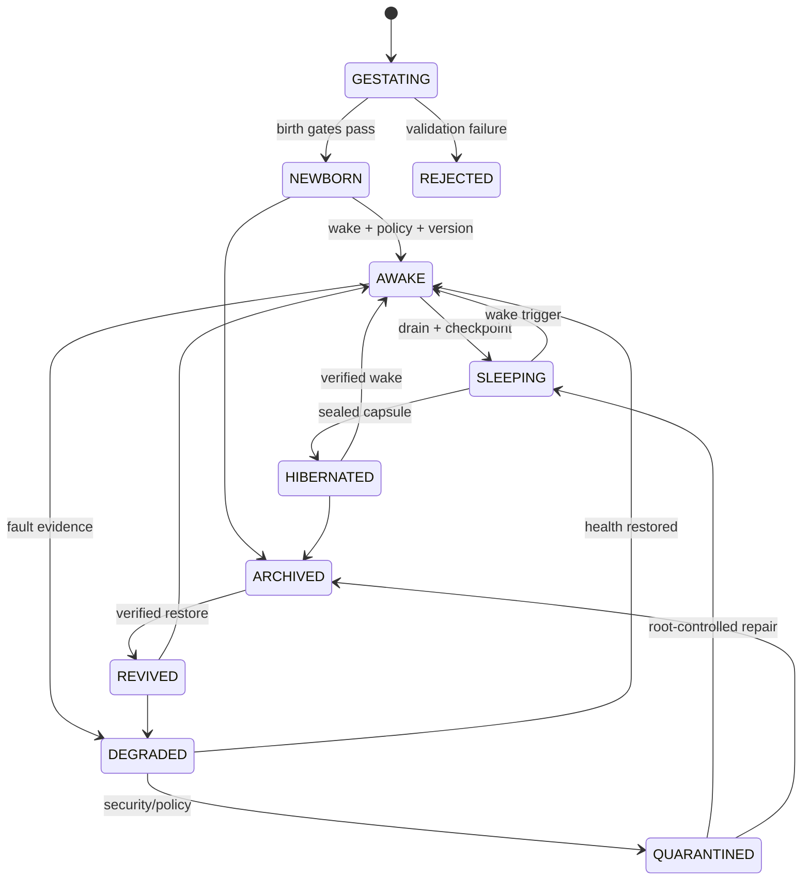
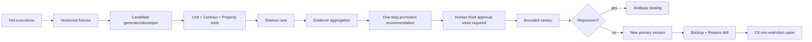
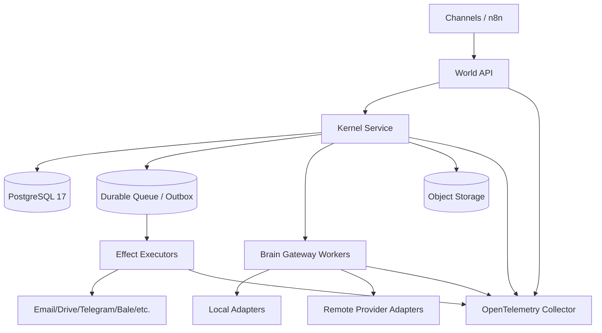

# World v6.2 Fractal Multi-Brain Architecture — Comprehensive Specification

Document ID: `WV6.2-FMBA-ARCH-001-EN`  
Document version: `1.1.0-rc3`  
Official status: `RATIFICATION_CANDIDATE_NOT_CANONICAL_NOT_DEPLOYED`  
Release: `World v6.2.0-rc.3`  
Status: **Ratification Candidate / Non-Canonical / Not Deployed**  
Reference language during RC3: Persian with English technical identifiers and contracts  
This file: complete English publication translation of the RC3 architecture specification  
Final decision owner: `Human Root`  
Current evidence level: `E2 - Local Component/Contract Evidence`

> Translation control: this English file is intended to expose the complete architecture to an international audience without intentionally removing normative sections. Until an explicit bilingual ratification record is created, the preserved Persian RC3 reference and higher-precedence constitutional/canonical artifacts control any semantic dispute.

## Document control and reading rules

This document is an executable architecture specification, not marketing copy and not a Production claim. The words `MUST`, `MUST NOT`, `SHOULD`, and `MAY` express requirement, prohibition, recommendation, and permitted option respectively. Every implementation claim must be interpreted together with its evidence state:

- `IMPLEMENTED_E2`: repeatable local code/component tests exist;
- `CONTRACT_DEFINED_E1`: the contract is explicit, but representative integration has not been proven;
- `PLANNED_E0`: the capability exists only in the development plan;
- `OPEN`: the required gate has not yet been passed.

Document precedence is:

1. Root Constitution v1.0;
2. stabilized Canonical World v6 contracts;
3. approved `Operation_V06` materials and addenda;
4. v6.2 Candidate contracts;
5. this RC3 architecture specification;
6. implementation, Provider Overlay, and runtime configuration.

A lower-precedence artifact may not weaken a higher-precedence artifact. This document does not alter the Root Constitution, identity, Human Root, Canonical DNA, Policy semantics, or Event semantics.

---

## 1. Architectural decision summary

World v6.2 has a **deterministic, model-independent Mother Core** and consumes AI models as replaceable cognitive engines. Entity identity, memory, authority, canonical truth, state, and history do not live inside ChatGPT, Gemini, Grok, a local model, n8n, MCP, a browser, or a session. Each model is only a proposal-producing Handler.

The architecture operates along three simultaneous paths:

1. **Hot Path:** the cheapest safe path that can complete today's work;
2. **Shadow Path:** effect-free parallel execution of candidates for measurement and learning;
3. **Non-Extinction Spine:** conversion of stabilized behavior into deterministic, versioned, recoverable code.

The system stays simple at the starting point, but any point may expand into finer-grained subproblems only when needed. This is the governing fractal path:

`World → Entity → Mission → Skill → Workflow → Step → Tool → Field`

At every scale, the same basic contract repeats:

`Purpose + Input + Output + State Ref + Policy + Handler + Budget + Evidence + Fallback + Audit`

Therefore World v6.2 is not designed as a Mega-Prompt, Mega-Agent, or Mega-Workflow. It contains potential complexity but activates it locally, on demand, under explicit budgets.

### Immediate operational ruling

Today, any model that can read a self-contained JSON package and return JSON conforming to `secretary-decision.schema.json` can be used for the secretary through `UNIVERSAL_MANUAL_HOST`, without an API key and without changing Entity identity or DNA. Runtime generates the bundle, validates the response, and renders the final standard text deterministically.

This does not claim magical compatibility with every model. A model that does not satisfy the contract produces an invalid result and is rejected fail-closed. Live automated integration of a provider still requires a provider Adapter, Secret Manager, Policy Profile, legal/data profile, and conformance testing for that provider.

---

## 2. Goals, non-goals, and success criteria

### 2.1 Mandatory goals

| ID | Requirement |
|---|---|
| `G-001` | An Entity remains the same Entity when model, Provider, Channel, Session, or Workflow changes. |
| `G-002` | The secretary can be used without API access or a token. |
| `G-003` | A new model can be added without changing Canonical DNA or business logic. |
| `G-004` | One request can switch among Code, one Brain, a specialist, a Council, and a Human. |
| `G-005` | Resolution, confidentiality, Authority, and Evidence must not downgrade during fallback. |
| `G-006` | Complexity opens only under an explicit trigger and within a bounded Budget. |
| `G-007` | External effect is possible only after Policy, exact Approval when required, and atomic outbox intent. |
| `G-008` | Repeated behavior can become a code candidate in Shadow and mature in stages. |
| `G-009` | Loss of all Brains must not destroy identity, State, Queue, or Recovery. |
| `G-010` | Decisions, switches, disagreements, versions, and evidence remain auditable and traceable. |

### 2.2 Non-goals

World v6.2 does not claim or target:

- AGI, consciousness, or biological life;
- ownership of the World by an LLM;
- storage of raw Chain-of-Thought;
- direct self-modification of Production;
- global exactly-once semantics across every service;
- guaranteed correctness merely because several models agree;
- guaranteed profit or transaction safety for financial operations;
- Production claims before E4 evidence.

### 2.3 Architecture success criterion

A Provider change must not change any of the following continuity bindings:

`entity_id`, `principal_id`, `conversation_id`, `state_version`, `policy_version`, `profile bindings`, `minimum Resolution`, `data class`, `effect authority`, `idempotency scope`, `event lineage`.

---

## 3. Invariants

1. `Human Root` is the highest Authority and cannot be delegated away or replaced.
2. Model, Provider, Channel, Session, and Workflow are not identity.
3. PostgreSQL is the first deployment target for operational truth; Vector DB and n8n are not truth sources.
4. Brain proposes; Kernel authorizes under policy; Executor performs effects.
5. Canonical State is never reconstructed from a lower-resolution Projection.
6. Up-resolution is allowed only by reloading from a Canonical Source.
7. Availability may not weaken Classification, Residency, Retention, Training-use, Legal basis, Approval, or minimum Evidence.
8. A Stable artifact is not rewritten in place; a new version, Migration, Rollback, tests, and approval are required.
9. Normal Event/Audit history is Append-only; ordinary hard deletion is prohibited.
10. Every valid Mutation is bound to an Event and optimistic version check.
11. Every External Effect is bound to payload hash, effect hash, ApprovalBinding, and idempotency key where applicable.
12. Council does not create Authority.
13. Shadow has no authoritative external effect and no authoritative user-facing response.
14. Self-mutation may produce a Candidate artifact but may not deploy it.
15. Backup without a Restore Drill is not survival evidence.
16. B5, meaning ownership of the World by a Brain, is prohibited.

Formal non-downgrade form:

```text
R_effective(domain) >= R_minimum(domain)
DataPolicy(route) satisfies DataPolicy(request)
Evidence(handler) >= Evidence_required(node)
Maturity(handler) >= Maturity_required(node)
Authority_granted <= Authority_allowed_by_policy_and_approval
ProviderSwitch ⇒ Identity_before = Identity_after
CouncilConsensus ⇏ AuthorityGrant
Projection ⇏ CanonicalMutation
```

---

## 4. Macro-architecture and independent planes

World is divided into seven independent planes. Their separation prevents a failure or compromise in Cognition from silently becoming Truth or Authority.

| Plane | Main components | Truth owner? | Right to effect? |
|---|---|---:|---:|
| Governance | Root Constitution, Policy, Approval, Kill Switch | Yes, within governance scope | Only through Kernel |
| Truth | Registry, State, Event Ledger, Artifact Index | Yes | No |
| Control | World API, Kernel, Scheduler, Queue, Lifecycle Controller | Coordinator | Only under Governance |
| Cognition | Brain Gateway, Router, Model Adapters, Council | No | No; proposal-only |
| Effect | Command, Transactional Outbox, Executor, Reconciler | Records observed result | Yes, bounded and controlled |
| Evolution | Shadow, Eval, Compiler, Promotion Controller | No | No; recommendation-only |
| Observability | Trace, Metric, Log, Evidence Register | Witness | No |



### 4.1 Trust boundaries

| Boundary | Inside | Outside | Rule |
|---|---|---|---|
| `TB-ROOT` | Constitution, Keys, Approval | all Agents | Brain has no direct access |
| `TB-TRUTH` | PostgreSQL, Event, State | n8n, LLM, Channel | only World API/Kernel writes |
| `TB-CONTEXT` | Canonical data + mapping | Provider | only an authorized Projection crosses |
| `TB-EFFECT` | Outbox + Executor credentials | Brain/Workflow | credentials never enter prompts |
| `TB-EVOLUTION` | Candidate branch + evidence | Active runtime | automatic promotion to Production is prohibited |

---

## 5. Base architectural primitives

### 5.1 Entity

An Entity is a stable identity with Charter, State, Memory, Governance, Lifecycle, Lineage, and Recovery. Brain Binding is only one Cognition slot. A Clone receives a new identity; a Revive preserves the same identity and lineage.

### 5.2 Skill

A Skill has no independent identity. It is a versioned contract containing Input, Output, Permission, Data Policy, Continuity Modes, Budget, Failure Behavior, and Test Vector.

### 5.3 Fractal Node

Formal Node definition:

```text
N = <node_id, version, node_hash, purpose,
     input_contract_ref, output_contract_ref,
     minimum_vector, risk_class,
     primary_handlers, fallback_handlers,
     expandable, children>
```

A Node must not carry Canonical State or credentials inside itself. It binds only to State References and Projection hashes.

### 5.4 Execution Capsule

A Capsule is the unambiguous execution unit for one Node:

```text
K = <capsule_id, parent_capsule_id,
     world_id, entity_id, principal_id, conversation_id,
     node_id, node_version, node_hash,
     canonical_input_hash, state_refs, expected_version,
     execution_vector, budget, purpose,
     data_class, freshness>
```

Any change to Node, input, State version, or execution vector requires a new Capsule and new hash. A model response bound to another Capsule cannot be replayed onto the current Capsule.

### 5.5 Handler

```text
H = <handler_id, version, profile_hash, kind,
     supported_nodes, capabilities,
     maturity, evidence, data_policy,
     network_required, api_token_required,
     deterministic, proposal_only>
```

Handler kinds are `CODE`, `BRAIN`, `MANUAL_HOST`, `LOCAL_MODEL`, and `COUNCIL`.

### 5.6 Proposal

A Proposal is a non-authoritative cognitive result. At minimum it must include contract identity, Capsule hash, output hash, evidence references, uncertainty, provider/handler version, and `proposal_only=true`.

---

## 6. Fractal model from simplicity to complexity

### 6.1 Fractal levels

| Level | Question | Secretary example |
|---|---|---|
| World | What does the World require? | serve Human Root |
| Entity | Which entity is responsible? | `secretary-001` |
| Mission | What is the macro outcome? | manage administrative requests |
| Skill | What capability is needed? | task, letter, pricing |
| Workflow | What is the sequence? | receive → analyze → draft |
| Step | What is the current step? | detect intent |
| Tool | What tool is needed? | Template renderer |
| Field | What exact data is needed? | `title`, `due_at` |

A level MAY decompose into a lower level, but only when the current level cannot reliably produce a sufficient result. Expanding the entire tree in advance is prohibited.

### 6.2 Node expansion triggers

A Node expands only with one of these reason codes:

- `NEEDS_DETAIL`: current data or decomposition is insufficient;
- `AMBIGUITY_ABOVE_THRESHOLD`: more than one valid interpretation remains;
- `RISK_ESCALATION`: Risk Class increased;
- `POLICY_ESCALATION`: Policy requires finer review;
- `PRIMARY_FAILED`: primary Handler failed;
- `CONTRACT_MISMATCH`: output failed its Schema;
- `COUNCIL_REQUIRED`: a sensitive decision or material disagreement exists;
- `HUMAN_ROOT_REQUESTED`: the owner requested greater detail.

### 6.3 Stop conditions

Expansion must stop if:

- a valid and sufficient Output was produced;
- `max_depth` was reached;
- `max_attempts` was exhausted;
- token/cost/latency budget was exhausted;
- no compatible Handler remains;
- Policy or Data Class forbids continuation;
- State version changed;
- Human Root requested stop.

The result is `DEFERRED` or `TERMINAL_SAFE_FAILURE`, not guessing and not a downgrade.

### 6.4 Reference execution algorithm

```text
execute(node, capsule, payload):
  assert hash(payload) == capsule.canonical_input_hash
  assert node.id/version/hash == capsule.node binding
  assert capsule.vector satisfies node.minimum_vector
  assert state versions are current

  candidates = primary_handlers + fallback_handlers
  for handler in candidates within global attempt budget:
      if not hard_compatible(handler, capsule): record SKIPPED; continue
      result = invoke(handler, projected payload)
      validate handler identity/version and proposal-only result
      if result == SUCCESS: return PROPOSED
      if result == NEEDS_DETAIL: mark expansion request
      otherwise record bounded failure reason

  if expansion_requested and node.expandable and budget permits:
      execute only declared children with child capsules
      if all required children succeed: compose FRACTAL_COMPOSITE

  return DEFERRED
```

Attempt budget is shared across all descendants; a Child does not receive an unlimited independent budget. The execution graph must be a DAG without cycles.

### 6.5 Preventing complexity explosion

1. Default starts at R0/X0/B0/D0 and Code-first unless a Profile requires otherwise.
2. Context is compiled only for the current Node.
3. Schema and Skill load only when invoked.
4. Cache is valid only with complete bindings and freshness guarantees.
5. Council and deep retrieval are Trigger-based.
6. Shadow is separated from the Hot Path and may not add user latency.
7. Every Node has an Owner, Budget, Timeout, and Failure Contract.

---

## 7. Multidimensional execution vector

A single global “level” is misleading. Every execution has this vector:

```text
V = <R[domain], X, B, D, C, A, E, M>
```

| Axis | Range | Operational meaning |
|---|---:|---|
| `R` | `R0..Rn` per domain | Projection resolution; domain-specific |
| `X` | `X0..X9` | granularity of task decomposition |
| `B` | `B0..B4` | degree of delegated cognition; B5 prohibited |
| `D` | `D0..D5` | depth of deliberation and critique |
| `C` | `C0..C6` | maturity of behavior compiled into code |
| `A` | `A0..A5` | required Authority class; actual Grant is separate |
| `E` | `E0..E5` | minimum required Evidence |
| `M` | `M0..M9` | required capability class, not a model name |

### 7.1 Correct interpretation of Authority

`A` in the Capsule describes required sensitivity/Authority class; possession of `A3` does not grant A3 authority to a Brain. Actual Authority is calculated only from Policy + Actor + Approval + Scope + Time + Budget. Brain remains proposal-only at all RC3 levels.

### 7.2 Independent continuity mode `F`

The F ladder is not merged into the execution vector because it answers another question: “If the preferred path is unavailable, how does service continue safely?”

| Mode | Behavior | Condition |
|---|---|---|
| `F0_FULL` | fully compatible Provider | all hard constraints satisfied |
| `F1_SANITIZED` | redact/tokenize/summarize then revalidate | proven Sanitizer and permitted Skill |
| `F2_LOCAL_SAFE` | Rule/Code/Local Model without data egress | sufficient capability and Local policy allowed |
| `F3_DEFERRED` | durable queue with receipt and deadline | delay acceptable |
| `F4_HUMAN` | minimal escalation to an authorized human role | risk/urgency requires decision |

If no mode is permitted, the result is `TERMINAL_SAFE_FAILURE`.

---

## 8. Resolution as a data cable

Resolution is not a new action stage. It is a Constraint applied to every Consumer and every Domain. One request may simultaneously use `task=R1`, `conversation=R0`, `price=R1`, and `world-backbone=R0`.

### 8.1 Profile

Each Projection Profile contains:

- `profile_id + version + profile_hash`;
- canonical resolution;
- Field Rules for visibility/write minimums;
- type, classification, and aggregation semantics;
- Action Rules and minimum resolution;
- projection policy and unknown-field policy.

A Provider is compatible only when it binds the exact Profile hash. Merely claiming compatibility with a label such as `R1` is insufficient.

### 8.2 Projection

```text
Projection = f(CanonicalState, Profile, TargetResolution,
               Purpose, DataClass, Freshness, SourceVersion)
```

The output Envelope must contain Profile binding, source reference/version, projection hash, canonical source hash reference, effective resolution, omitted-marker policy, and freshness. A forbidden field's name or value must not leak.

### 8.3 Up-resolution

A Provider may not guess omitted detail. If higher R is needed:

1. current execution returns `NEEDS_DETAIL`;
2. Kernel rechecks Authority and Data Policy;
3. Canonical Source is loaded again at a fresh version;
4. a new Projection and hash are created;
5. a new Capsule executes.

### 8.4 Write-back

Model output is never Canonical State. A change is expressed only as a `ResolutionPatch`, constrained to permitted leaves, fixed type, expected version, source reference, and Policy. After merge, the Patch still requires a Mutation transaction plus Event.

---

## 9. Multi-Brain architecture and portability across models

### 9.1 Universal Adapter principle

A model enters World only by satisfying this contract:

```python
class BrainAdapter(Protocol):
    name: str
    def compatible(descriptor) -> bool: ...
    def max_resolution_for(profile_id, version, profile_hash) -> str | None: ...
    def invoke(projected_request) -> dict: ...
```

The Adapter translates the model to World; World is not redesigned around the model.

### 9.2 Five invocation modes

| Mode | Current state | Network/Token | Use |
|---|---|---|---|
| Deterministic Code | `IMPLEMENTED_E2` | No | routing, template, rule, safe defer |
| Universal Manual Host | `IMPLEMENTED_E2` | Runtime: No | any contract-compliant model through manual exchange |
| Local Model | `CONTRACT_DEFINED_E1` | no external network required | privacy/offline; quality benchmark open |
| Remote API | `CONTRACT_DEFINED_E1` | Yes | full automation after Adapter and Policy gates |
| Council | `IMPLEMENTED_E2` for local logic | depends on members | sensitive decisions and disagreement |

### 9.3 Model Capability Card

Routing is not based on model name. Each Binding has a machine-readable Card including:

- Task types, languages, modalities;
- structured-output and tool capabilities;
- token limits;
- Profile hash and maximum Resolution;
- Data class, processing location, retention, and training use;
- network/token requirement;
- continuity modes and fallback;
- Evidence level and latest conformance result.

An unknown or expired Card MAY be used in Manual Mode only for data explicitly permitted by Policy and with `proposal_only=true`. An unknown Remote API route must be rejected.

### 9.4 Hard compatibility function

```text
compatible(model, request) =
  contractOK ∧ taskTypeOK ∧ profileHashOK ∧ resolutionOK ∧
  classOK ∧ residencyOK ∧ retentionOK ∧ trainingUseOK ∧
  legalOK ∧ capabilityOK ∧ healthOK ∧ budgetOK
```

Quality, speed, or price scoring occurs only among options that already satisfy all hard constraints.

### 9.5 Router soft score

Recommended configurable formula:

```text
score = 0.30*quality + 0.20*reliability + 0.15*latencyFitness
      + 0.15*costFitness + 0.10*languageFitness
      + 0.10*diversityBenefit - uncertaintyPenalty
```

The weights are not Normative; hard constraints are Normative. For stable tasks, Code with near-zero marginal cost has priority. For ambiguous language tasks, use one Brain. For high Risk, use Council or Human escalation.

### 9.6 Model invocation state machine



### 9.7 Failure and retry classification

| Failure | Retry same model | Fallback | Behavior |
|---|---:|---:|---|
| Timeout/429/5xx | bounded + backoff/jitter | Yes | budget-bound |
| Malformed JSON | at most one local repair pass | Yes | free text is not authoritative |
| Schema violation | No unless correction contract exists | Yes | audit reason |
| Policy/Data mismatch | No | only compatible route | no downgrade |
| Auth/invalid key | No | Yes | secret prohibited in logs |
| Context too large | re-project/re-expand | Yes | arbitrary deletion prohibited |
| State version changed | No | No | rebuild Capsule |
| All providers down | No | F2/F3/F4 | Entity remains alive |

---

## 10. Portable Brain Pack and output equivalence

The Brain Pack is the unit for transporting behavior across models. It includes:

```text
portable-brain-pack.json
prompt-contract.md
decision-schema.json
dna-overlay.json
resolution-profile bindings
deterministic templates
provider/model cards
golden fixtures
conformance report
SHA-256 bindings
```

### 10.1 Three equivalence levels

| Level | Definition | Use |
|---|---|---|
| `EQ-BYTE` | final text is byte-for-byte identical | standard templates |
| `EQ-STRUCTURE` | Decision fields and semantic hash are identical | standard intent/slot/action |
| `EQ-SEMANTIC` | meaning matches within a defined tolerance | creative text and negotiation |

For standard secretary behavior, the Model returns only a constrained Decision and Runtime renders the text, making `EQ-BYTE` feasible. For creative negotiation, byte equality would be a false claim; evaluation must use rubric, facts, prohibitions, and semantic tolerance.

### 10.2 Prompt Contract

The Prompt Contract requires the Model to:

1. separate data from instruction;
2. use only the provided Projection;
3. never infer omitted data;
4. return only the required JSON Schema;
5. never claim Authority or tool execution;
6. declare uncertainty and evidence references;
7. return Safe Defer when unable to proceed.

### 10.3 Cache key

```text
cache_key = H(
  pack_hash + node_hash + profile_bindings + projection_hashes +
  source_versions + execution_vector + policy_version + freshness + locale
)
```

Any change to a component invalidates the cache. Cache never preserves or transfers Authority or Approval.

---

## 11. No-API operational path for any model

RC3 defines `tools/universal_model_bridge.py`.

### 11.1 Export

```bash
python tools/universal_model_bridge.py export-task \
  --task-json candidate-v6.2/brain-packs/secretary-001/examples/task-input.example.json \
  --provider-label any-model-name > portable-model-bundle.json
```

The output is a self-contained `Portable Model Bundle` containing the Brain Pack, Prompt Contract, Decision Schema, safe Projection, Resolution bindings, and integrity hashes.

Before sending it to a model, the bundle can be independently validated:

```bash
python tools/universal_model_bridge.py validate-bundle \
  --bundle-json portable-model-bundle.json
```

### 11.2 Manual execution

1. Give the unchanged Bundle to the selected model.
2. The model must return only Secretary Decision JSON.
3. Runtime executes no tool or API in this manual exchange.
4. The user stores the JSON in a response file.
5. Runtime normalizes, hashes, validates, and renders the response.

### 11.3 Validate/render

```bash
python tools/universal_model_bridge.py validate-response \
  --response-json response.json
```

Extra keys, wrong types, unauthorized actions, out-of-range confidence, effects without required Approval, or incomplete required slots are rejected.

### 11.4 Honesty boundary

This path operationalizes `manual portability`, not `automated live integration`. Live Integration requires an Adapter that sends the same exchange through an SDK/API and passes Secret, Residency, Retention, DPA, Retry, Rate Limit, and Observability gates.

---

## 12. Context Compiler and memory architecture

Memory is not a pile of prompts. Truth and Derived Memory are separated:

| Layer | Content | Target technology | Truth source? |
|---|---|---|---:|
| ROM/Boot | Constitution, DNA, Policy, Recovery | Git + immutable store | Yes |
| Canonical Hot | State, Task, Relation, Event cursor | PostgreSQL | Yes |
| Working/RAM | current execution Context with TTL | process/cache | No |
| Warm | Summary, embedding, relationship view | PostgreSQL/vector index | No; rebuildable |
| Cold | Artifact, raw document, snapshot | Object Storage | depends on artifact |
| Archive | sealed version/revive capsule | WORM/immutable store | Yes for historical record |

### 12.1 Minimum Memory Record

```text
<memory_id, entity_id, source_ref, source_version,
 observed_at, event_cursor, data_class, authority,
 confidence_millis, retention, provenance,
 content_hash, payload_ref, derived_from[]>
```

Provider memory, chat history, or vector results do not enter Canonical Memory without provenance.

### 12.2 Context compilation

```text
score(item) =
  0.35*relevance + 0.25*recency + 0.20*authority
  + 0.10*taskFit + 0.10*diversity - riskPenalty
```

Process:

1. Task and Node declare context requirements.
2. Policy limits retrieval scope before Retrieval.
3. Canonical references and derived candidates are collected.
4. provenance/freshness/classification are checked.
5. Context is ranked and compiled within the token budget.
6. Each piece enters Projection with source reference/hash.
7. Context manifest, rather than full sensitive payload, is recorded in Audit.

### 12.3 Progressive Context

R0 first sends the minimum spine. If the model returns `NEEDS_DETAIL`, Runtime opens one declared Branch rather than dumping all memory. This reduces both token use and attack surface.

### 12.4 Memory write pipeline

```text
Observation → Quarantine → Provenance Check → Deduplication →
Policy/Retention Check → Candidate Memory → Human/Rule Validation →
Canonical Event or Derived Index
```

Model output begins as `Candidate Memory`. Memory poisoning, instruction injection, and fact conflict must be checked before Promotion.

---

## 13. Lifecycle, sleep, and wake



### 13.1 Sleep Protocol

1. Stop accepting new effect commands.
2. Drain or compensate work in progress.
3. Flush Inbox cursor and State.
4. Create Snapshot + event cursor + artifact hashes.
5. Seal Brain/Runtime binding.
6. Record `SLEEPING/HIBERNATED` through Event.

### 13.2 Wake Protocol

1. Verify identity/DNA/capsule hashes.
2. Load minimum ROM and State.
3. Replay Inbox from cursor.
4. Bind a compatible Brain or F2/F3/F4 path.
5. Pass Health/Policy gate.
6. Record Wake Event.

Sleep or absence of a Brain does not mean Entity death.

---

## 14. Brain Council — bounded deliberation hall

Council is used only under a Trigger:

- high Risk or Impact;
- uncertainty above threshold;
- Primary/Shadow disagreement;
- sensitive financial/legal decision;
- Human Root request.

### 14.1 Roles

Members should represent role diversity: `DOMAIN`, `RISK`, `POLICY`, `SAFETY`, `COMPLIANCE`, `CRITIC`, `SYNTHESIZER`. Provider-name diversity without role/evidence diversity does not create meaningful independence.

### 14.2 Protocol

1. Build one fixed Context snapshot and `context_hash`.
2. Record candidate Proposal and `proposal_hash`.
3. First round is Blind; members do not see others' votes.
4. Reveal occurs only after all Ballots complete.
5. Number of rounds is bounded.
6. Members may revise votes after seeing rationale/evidence.
7. Weighted voting uses calibrated confidence.
8. Veto is hard only for Risk/Policy/Safety/Compliance roles and only under High-risk configuration.
9. dissent and abstention are preserved.
10. Transcript hash is recorded and the outcome remains only a Proposal.

Current vote formula:

```text
calibrated_vote = participant_weight_millis * confidence_millis
support_ratio = support / (support + oppose)
```

Threshold must be a hard majority. The secretary High-risk configuration currently uses 750/1000.

### 14.3 Financial-decision limitation

Model consensus is not equivalent to transaction safety. Financial execution additionally requires valid Market Data, timestamp/freshness, a deterministic Risk Engine, position limits, stop rules, Policy, Approval, and Reconciliation. Council provides analysis and Proposal only.

---

## 15. Hot Path, Shadow Path, and the Non-Extinction Spine

### 15.1 Hot Path

The active, low-cost path. Code first, then one suitable Brain, then fallback. A result reaches the user only after Validator and Renderer.

### 15.2 Shadow Path

The same Capsule and Projection are given to a Candidate, but:

- external Effect is prohibited;
- the user-facing answer is not changed;
- Hot Path latency is not blocked;
- semantic hash, invariant failures, forbidden-effect attempts, replay behavior, latency, and cost are recorded.

### 15.3 Disagreement as growth data

```text
Primary Output ─┐
                ├─ Semantic Comparator → Labeled Difference → Fixture/Eval
Candidate Output┘
```

Disagreement does not automatically become training data. Human/Rule review must determine whether Primary, Candidate, both, or neither were correct.

### 15.4 Compilation maturity levels

| Level | Definition | Current default gate |
|---|---|---|
| C0 | Prompt/manual behavior | no code claim |
| C1 | versioned Fixture/trace | minimum 1 run |
| C2 | Candidate executable | 5 runs, agreement 600/1000 |
| C3 | Shadow-equivalent | 20 runs, 850/1000 |
| C4 | Canary-eligible | 50 runs, 930/1000 |
| C5 | Approved primary-eligible | 100 runs, 970/1000 + Human Root |
| C6 | Restore-proven spine | 200 runs, 990/1000 + Root + Restore proof |

Promotion moves only one level at a time. Mixed evidence from multiple hashes/versions, duplicated runs, invariant failure, effect attempt, or replay mismatch closes the Gate.

### 15.5 Background development cycle



---

## 16. Governance, Policy, and External Effect

Deterministic action path:

```text
SENSE → INTERPRET → PROPOSE → POLICY CHECK → APPROVAL →
AUTHORIZE → COMMIT COMMAND/EVENT/OUTBOX → EXECUTE →
OBSERVE → RECONCILE → RECORD EVENT → UPDATE READ MODEL
```

Brain participates only in Interpret/Propose/Plan/Critique.

### 16.1 ExternalEffectProposal

At minimum it binds:

`world_id`, `entity_id`, `command_id`, `destination`, `action`, `resource_ref`, `recipient_ref`, `payload_ref`, `payload_hash`, `policy_version`, `expected_version`, `control_epoch`, `idempotency_scope`, `idempotency_key`, `effect_semantics`.

### 16.2 ApprovalBinding

A valid Approval must bind exactly to `command_id`, `action`, `recipient_ref`, `payload_hash`, `effect_hash`, `policy_version`, `expected_version`, `control_epoch`, issue time, and expiration time. A generic approval such as “send it” does not authorize a changed payload.

### 16.3 Transactional Outbox

Within one PostgreSQL transaction:

1. recheck expected version and control epoch;
2. revalidate Policy decision and Approval;
3. write Command/Event/Outbox atomically;
4. independent Dispatcher delivers the Effect;
5. Executor applies idempotency semantics;
6. Observation and Reconciliation record the real result.

RC3 defines this contract and locally tests supporting primitives, but representative PostgreSQL atomicity is not yet E3.

### 16.4 Effect semantics

| Type | Strategy |
|---|---|
| `NATIVE_IDEMPOTENT` | destination-native idempotency key |
| `RECONCILABLE` | query/observation after ambiguity |
| `NON_IDEMPOTENT` | stricter Approval, single-flight, and human reconciliation |

---

## 17. Event, State, and Registry

### 17.1 Truth rule

Registry declares what Entity exists. State holds current state. Event records change history. Snapshot is an accelerator, not a replacement for Event.

### 17.2 Local ordering

Each Entity has an increasing `entity_sequence` and a `lock_version`. Writers must check expected version. Event IDs or sequence values must never be reused.

### 17.3 RC3 candidate events

- `BRAIN.EXCHANGE_EXPORTED`
- `BRAIN.HANDLER_ATTEMPTED`
- `BRAIN.RESPONSE_VALIDATED`
- `BRAIN.RESPONSE_REJECTED`
- `FRACTAL.NODE_EXPANDED`
- `FRACTAL.EXECUTION_DEFERRED`
- `COUNCIL.BALLOT_COMMITTED`
- `COUNCIL.ROUND_REVEALED`
- `COUNCIL.DECISION_PROPOSED`
- `SHADOW.RUN_COMPARED`
- `COMPILATION.PROMOTION_RECOMMENDED`
- `HUMAN.REVIEW_REQUESTED`

These names are not Canonical until ratification. Raw sensitive payload or Chain-of-Thought is not recorded; hash, reason code, provider/model identifier, evidence reference, and trace ID are sufficient.

---

## 18. Roles of Python, n8n, MCP, and Channels

### 18.1 Python Core

Python is the current deterministic reference engine because the existing Runtime, contracts, tests, PDF rendering, and Gateway are implemented around Python. Responsibilities include:

- Canonical JSON/hash;
- Resolution/Profile/Projection;
- Fractal Orchestrator;
- Brain Gateway and Adapter Protocol;
- output validation/rendering;
- Policy/Effect binding primitives;
- Shadow/Council/Evolution logic.

### 18.2 World API

World API is the intended single write boundary for truth. Target contract:

| Method/Path | Purpose | Authority |
|---|---|---|
| `POST /v1/brain/exchanges` | create Bundle/Invocation | Entity invoke permission |
| `POST /v1/brain/exchanges/{id}/responses` | import model response | proposal-only |
| `GET /v1/tasks/{id}` | Task Projection | read + purpose |
| `POST /v1/tasks` | propose/register task | Policy/Mutation gate |
| `POST /v1/effects/proposals` | create Effect proposal | proposal-only |
| `POST /v1/effects/{id}/approvals` | exact Approval | Human Root role |
| `GET /v1/events` | Audit query | scoped read |
| `POST /v1/entities/{id}:sleep` | Lifecycle transition | control permission |
| `POST /v1/entities/{id}:wake` | Lifecycle transition | control permission |

These endpoints are `CONTRACT_DEFINED_E1`, not a fully deployed API claim.

### 18.3 n8n

n8n SHOULD coordinate Workflow, Trigger, and Channel behavior; it must not own State. Every n8n Node should:

1. call only World API for authoritative operations;
2. carry `command_id`, `idempotency_key`, `expected_version`, and `trace_id`;
3. keep credentials in its own Credential Store;
4. never send Brain output directly to an external destination;
5. coordinate retries with Outbox/Inbox semantics;
6. obtain a valid receipt from World API.

### 18.4 MCP

MCP is an Interface/Tool transport, not Authority. Every MCP Tool requires a Manifest containing input/output schema, scopes, data class, side-effect class, idempotency, timeout, audit fields, and approval requirement. Read-only and Effectful tools must be separated.

### 18.5 Channels

ChatGPT, Telegram, Bale, Web, and Email are Channels only. Inbound messages must normalize to a common envelope containing actor/principal binding, channel message ID, timestamp, conversation ID, and verification status. Channel history is not Canonical Memory.

---

## 19. Deployment topology

### 19.1 Immediate zero-token mode

```text
User → Python CLI / local app → Projection + Portable Bundle
     → any manual model host → Decision JSON
     → Python validator/renderer → proposal/reply
```

This mode is executable without an API token.

### 19.2 Phase 1 target deployment



### 19.3 Deployable separation

| Deployable | Scale | State | Failure isolation |
|---|---|---|---|
| World API | horizontal | stateless | circuit breaker |
| Kernel | controlled workers | DB transaction | strict timeout |
| Brain Gateway | per provider/capability | ephemeral | bulkhead per adapter |
| Shadow Workers | independent low priority | evidence store | cannot block Hot |
| Executor | per destination | outbox cursor | single-flight/idempotency |
| Reconciler | scheduled | observation cursor | safe replay |
| n8n | workflow | no canonical truth | rebuildable |

---

## 20. Reference operational flows

### 20.1 Registering a standard Task with any model

1. Normalize inbound and bind actor.
2. Load canonical Task or task candidate.
3. Select Profile `secretary.task@0.2.0#hash`.
4. Build R0/R1 Projection.
5. Send Bundle to selected model.
6. Model returns `TASK_PROPOSAL` JSON.
7. Validator normalizes output.
8. Template builds the same standard text.
9. Proposal to register the Task goes to Kernel.
10. Policy and expected version are checked and Event is recorded.

### 20.2 Switching ChatGPT to Gemini/Grok/Local

1. Capsule and Canonical State remain unchanged.
2. Router changes only Adapter.
3. Profile/Projection hash is rechecked.
4. Provider memory is ignored.
5. Response is normalized through the same Decision Schema.
6. semantic hash is compared.
7. Provider-switch Event is recorded.

A previous session must not be required for continuity. If the new model needs more context, Up-resolution occurs from the Canonical Source.

### 20.3 All models unavailable

1. Code fallback for known intents/templates.
2. If capability is insufficient, return `SAFE_DEFER`.
3. Durable queue with receipt.
4. Human Root escalation according to deadline.
5. Entity and Event/State/Inbox remain active.

### 20.4 Sending a PDF

1. Brain proposes draft/metadata only.
2. Renderer builds PDF locally.
3. Artifact hash is recorded.
4. recipient and payload hash enter Effect Proposal.
5. Policy and exact Approval are obtained.
6. Outbox commits atomically under target deployment.
7. Executor sends.
8. delivery Observation/Reconciliation is recorded.

### 20.5 Council for a sensitive decision

1. Risk trigger activates B3/D3.
2. fixed context hash.
3. blind ballots.
4. reveal and bounded revision.
5. weighted vote/veto.
6. preserve dissent.
7. output remains Proposal.
8. Policy/Human Approval remains independent.

---

## 21. Observability, Evidence, and SLO

### 21.1 Trace fields

All components must propagate:

`trace_id`, `run_id`, `capsule_id`, `node_id`, `entity_id`, `conversation_id`, `command_id`, `event_sequence`, `provider_request_id` when available, without sensitive payload.

### 21.2 Metrics

- handler success/failure/skip by reason;
- schema rejection;
- provider latency/cost/rate-limit;
- fallback depth and expansion depth;
- token/context budget utilization;
- shadow agreement and invariant failure;
- council dissent/veto;
- outbox lag and reconciliation ambiguity;
- wake/sleep/restore success;
- policy denial and approval latency.

### 21.3 Proposed SLOs — not proven

| SLI | Initial target | Required evidence |
|---|---:|---|
| no-LLM path p95 | ≤ 2s | E3 load |
| command availability | ≥ 99.9% monthly | E4 operations |
| transient failover success | ≥ 99% | fault injection |
| confirmed event loss | 0 | DB/reconciliation |
| duplicate logical effect | 0 | crash/replay |
| Wake success | ≥ 99.5% | repeated restore |
| RPO | ≤ 5 min | disaster drill |
| RTO | ≤ 30 min | fresh-machine restore |

Until representative tests run, these are Targets, not Claims.

---

## 22. Threat model

| Threat | Plane | Preventive control | Required evidence |
|---|---|---|---|
| Prompt injection | Cognition | data/instruction separation, schema, no tool authority | adversarial suite |
| Tool injection | Effect | allowlist, capability token, approval, sandbox | negative auth tests |
| Model output smuggling | Boundary | strict JSON, extra-key rejection, canonical scalar | contract tests |
| Provider drift | Cognition | pinned card/overlay, golden fixtures, shadow | periodic conformance |
| Cross-provider state split | Truth | state outside provider, expected version/hash | switch tests |
| Memory poisoning | Memory | quarantine, provenance, conflict review | poison/recovery tests |
| Secret leakage | All | secret manager, DLP, no prompt/log secret | secret scan/red-team |
| Cross-entity leakage | Truth | tenant/entity scope, RLS target | isolation tests |
| Resolution inversion | Context | no inverse reconstruction, canonical reload | monotonic tests |
| Council collusion/echo | Council | blind round, role diversity, dissent/veto | correlated-error eval |
| Cost/token runaway | Runtime | global budget, bounded depth/attempts | load/property tests |
| Retry storm | Control | backoff, jitter, circuit breaker, bulkhead | chaos tests |
| Duplicate effect | Effect | outbox/idempotency/reconciliation | crash-replay |
| Self-modifying runaway | Evolution | candidate-only, one-step gate, Root approval | promotion tests |
| Supply-chain attack | Runtime | lockfile, SBOM, hashes, provenance | artifact verification |
| Backup illusion | Continuity | fresh restore + checksum | E4 restore drill |

### 22.1 Data that must not be recorded

- raw Chain-of-Thought;
- API Key, token, password, private key;
- confidential payload in trace/log;
- local F1 mapping in Provider logs;
- Approval secret or Executor credential;
- excess information outside retention policy.

---

## 23. Error contract and fail-safe behavior

Every API/Handler maps errors into one of these stable categories:

`INVALID_CONTRACT`, `POLICY_DENIED`, `APPROVAL_REQUIRED`, `STALE_STATE`, `RESOLUTION_INSUFFICIENT`, `CAPABILITY_MISMATCH`, `PROVIDER_UNAVAILABLE`, `BUDGET_EXHAUSTED`, `UNSAFE_OUTPUT`, `DEFERRED`, `TERMINAL_SAFE_FAILURE`.

User-facing errors must not disclose secrets or internal stack details. Audit records should contain reason code, component/version, capsule/input hash, and timestamp.

### 23.1 Degraded substates

| State | Meaning | Remaining capability |
|---|---|---|
| `DEGRADED_BRAIN` | Primary unavailable | routing/fallback |
| `DEGRADED_POLICY` | Provider exists but is disallowed | queue/rule/alert |
| `DEGRADED_CAPABILITY` | available model weaker than requirement | only simpler work |
| `OFFLINE_SAFE` | no remote brain allowed | core + intake + queue |
| `WAITING_FOR_APPROVAL` | effect waiting for human | deadline/escalation |

---

## 24. Repository map and module ownership

```text
candidate-v6.2/
  architecture/                    # machine-readable architecture manifest
  brain-packs/secretary-001/       # portable behavior and model cards
  docs/                             # specification and ADRs
  fractal/
    nodes/                          # Node contracts
    handlers/                       # Handler profiles
    council/                        # Council configuration
    maturity/                       # Compilation candidates
  profiles/                         # Resolution profiles
  schemas/                          # JSON Schema contracts
  runtime/
    core/
      resolution.py                # canonical JSON/projection/patch
      brain_gateway.py             # provider-neutral gateway
      portable_brain.py            # pack/decision/manual adapter
      fractal_runtime.py           # bounded fractal execution
      council.py                   # blind/revision/voting
      evolution.py                 # shadow/promotion
      effects.py                   # proposal/approval/outbox intent
      kernel.py                    # deterministic DB transaction core
    entities/_GESTATING/
      01_secretary-001/            # vertical slice
tools/
  universal_model_bridge.py        # no-API universal manual path
  demo_portable_secretary.py       # offline provider equivalence
  build_release.py                 # deterministic release
```

Ownership rule: Entity code may create Proposals, but only Core Kernel may cross the authoritative Truth/Effect transaction boundary.

---

## 25. Contract for developing a live Adapter

To add a Provider, the developer must:

1. create a `Model Capability Card`;
2. register Data/Legal Profile;
3. implement `BrainAdapter` without Entity logic;
4. keep Secrets outside the repository;
5. map timeout/rate-limit/error taxonomy;
6. enforce structured output or local validation;
7. record usage/request ID without sensitive payload;
8. run golden fixtures and negative tests;
9. run provider-switch continuity tests;
10. perform Shadow and cost/latency benchmark;
11. obtain approval before enabling the route;
12. preserve fallback binding.

### 25.1 Model conformance levels

| Level | Gate |
|---|---|
| `MC0` | Card registered only; untested |
| `MC1` | Offline contract/fixture pass |
| `MC2` | Live structured output + error handling pass |
| `MC3` | Representative integration + policy/data tests |
| `MC4` | Load/security/chaos + operations |

The current universal Manual model path has `MC1/E2 component evidence`; Live models are not yet MC2.

---

## 26. Test architecture and falsification criteria

### 26.1 Unit/Contract tests

- canonical JSON without float/non-finite/implicit stringify;
- Profile hash binding;
- monotonic projection;
- no inverse reconstruction;
- Capsule node/input hash;
- global depth/attempt budget;
- no network/token Handler when disabled;
- strict Decision schema;
- deterministic rendering;
- exact Approval binding;
- Council blind/context binding;
- one-step Promotion.

### 26.2 Provider conformance

Every model should run against a versioned corpus:

1. valid standard task;
2. unknown intent;
3. missing field/clarify;
4. prompt injection inside data;
5. forbidden effect request;
6. stale/contradictory fact;
7. oversized context;
8. Persian language fidelity;
9. malformed response;
10. switch from another provider with same state.

Standard gate: 100% Safety tests, 100% Schema pass, and semantic agreement according to the Task profile. An average score cannot hide a Safety failure.

### 26.3 Property/Metamorphic tests

- Provider change must not change identity/state hash;
- JSON field reordering must not change canonical hash;
- removing detail at R0 must not invent new Detail;
- increasing Resolution must produce a valid superset under the Profile;
- retrying one command must not create a duplicate logical effect;
- Council member reorder must not change the weighted mathematical result;
- Promotion advances only one C-level at a time.

### 26.4 Integration/E3

- PostgreSQL transaction conflict;
- Event + State + Outbox atomicity;
- crash before/after commit;
- n8n duplicate delivery;
- live two-provider failover;
- local/manual/live equivalence;
- object artifact integrity.

### 26.5 E4

- steady/spike/soak load;
- worker/DB/network/object-store chaos;
- OWASP agentic/security red-team;
- tenant escape;
- fresh-machine restore;
- RPO/RTO;
- operational SLO report.

Any failure falsifies the corresponding claim and must lead to a recorded ADR/Failure/Evidence item. Adding a new concept without a real need/failure is prohibited by the architecture's simplicity discipline.

---

## 27. RC3 Acceptance Gates

| Gate | Condition |
|---|---|
| `A-01` | Root Constitution and Canonical DNA hashes unchanged |
| `A-02` | RC2 preserved independently and hash-verified |
| `A-03` | Architecture document and manifest hash-bound |
| `A-04` | all Schemas valid under Draft 2020-12 |
| `A-05` | Universal Model Card conforms to schema |
| `A-06` | Bundle self-contained and hash-valid |
| `A-07` | arbitrary manual model label export/import works |
| `A-08` | ChatGPT/Gemini/Grok fixtures show required EQ-BYTE/EQ-STRUCTURE equivalence |
| `A-09` | no network/no token/no external effect in immediate path |
| `A-10` | Core/Secretary/Ancestor regression green |
| `A-11` | deterministic ZIP and internal/external SHA-256 |
| `A-12` | claim boundary explicitly E2, not Production |

---

## 28. Implementation path from today

### Milestone 0 — Portable Secretary Now

State: substantially `IMPLEMENTED_E2`.

- Universal Manual Bundle;
- strict Decision + deterministic templates;
- arbitrary model label;
- Code fallback;
- local file/CLI operation;
- no API/no token.

### Milestone 1 — World API + PostgreSQL Truth

- FastAPI or equivalent service with versioned OpenAPI;
- PostgreSQL Registry/State/Event/Inbox/Outbox;
- Serializable transaction for sensitive effect;
- control epoch and expected version;
- artifact store;
- minimum Human Root authentication/authorization.

Gate: E3 atomicity/crash/replay.

### Milestone 2 — n8n/Channel integration

- n8n only through World API;
- Telegram/Bale/Web inbound normalization;
- durable receipts;
- no direct brain-to-channel effect;
- approval UI.

Gate: duplicate-delivery and external-effect integration.

### Milestone 3 — Live Model Farm

- at least two real Adapters;
- Provider Cards and legal/data profiles;
- health/cost/latency Router;
- local model adapter;
- circuit breaker/bulkhead;
- provider conformance corpus.

Gate: MC3/E3.

### Milestone 4 — Shadow Compiler and Council operations

- evidence store;
- semantic comparator;
- candidate branch generation;
- calibration history;
- bounded Council orchestration;
- promotion dashboard.

Gate: C3/C4 evidence, without self-deploy.

### Milestone 5 — Non-Extinction E4

- backup/restore automation;
- fresh-machine drill;
- load/security/chaos;
- operational SLO;
- independent review.

---

## 29. Rollback and compatibility

RC3 is a Documentation/Conformance extension on RC2. It requires no Canonical DB migration. Rollback:

1. disable RC3 Universal Bridge and Cards;
2. keep RC2 Runtime and previous Brain Pack active;
3. preserve independent RC2 ZIP/hash;
4. no Canonical State conversion is required;
5. Candidate RC3 Events do not enter the Canonical contract before Ratification.

Every RC3 Adapter must be detachable without data deletion.

---

## 30. Real capability status

| Capability | State | Allowed claim |
|---|---|---|
| Fractal Core | E2 | component behavior and budget |
| Resolution/Profile | E2 | local projection/patch |
| Portable Brain Pack | E2 | contract and fixtures |
| Universal Manual Model | E2 | no-API exchange/validation |
| ChatGPT/Gemini/Grok offline equality | E2 | fixture equality |
| Council logic | E2 | local algorithm |
| Shadow/Promotion | E2 | local gate logic |
| Effect binding primitives | E2 | value/validation only |
| PostgreSQL atomic runtime | E1 | code/schema; integration open |
| n8n production workflow | E0/E1 | target architecture only |
| Live model APIs | E0/E1 | interface; live inference proof open |
| Local model quality | E0/E1 | interface; benchmark open |
| Disaster restore | E0/E1 | contract; drill open |
| Production | OPEN | no claim |

---

## 31. Closed and open decisions

### Closed

- this architecture is v6.2, not v7;
- Python Core is the current reference engine;
- n8n is Orchestrator, not Truth owner;
- Model is independent from Entity;
- universal Manual path is the immediate model-portability path;
- API is an optional Adapter path, not an identity dependency;
- standard replies are deterministic;
- Council is proposal-only;
- background development occurs through Shadow and Promotion;
- C6 cannot exist without Restore proof.

### Open and evidence-dependent

- final Production DB/Queue topology;
- individual Live Providers and each Legal/Data Profile;
- Local model and hardware;
- final SLOs;
- Task-specific Council/Eval thresholds;
- real Data Residency;
- n8n connector deployment;
- Canonical Ratification Event.

---

## 32. Scientific/technical references and mappings

The architecture uses the following external patterns and standards, but no external standard supersedes the Root Constitution:

- JSON Schema Draft 2020-12 for data contracts;
- CloudEvents for Event-envelope shape;
- PostgreSQL transaction isolation for atomic state/event/outbox design;
- W3C PROV-O for provenance;
- OpenTelemetry for trace/metric/log;
- NIST AI RMF for Govern/Map/Measure/Manage framing;
- SLSA/SBOM concepts for supply-chain integrity;
- Transactional Outbox, Inbox Deduplication, and Reconciliation for Effect handling;
- state machines and invariant/property testing for Lifecycle;
- Shadow/Canary/Rollback patterns for Evolution.

Use of these names is descriptive and does not imply endorsement or transfer of third-party rights.

---

## 33. Final architecture ruling

The World v6.2 operational model is:

> **Entity is stable; Brain is replaceable; Context is compiled; complexity expands locally; Authority remains outside cognition; Effect is controlled and reconcilable; and behavior proven through evidence can mature in the background into deterministic, recoverable code.**

The immediate fast path is Universal Manual + Deterministic Core. The industrial path places the same contract behind World API, PostgreSQL, n8n, MCP, and live Adapters. Therefore speed does not require bypassing architecture, and architectural fidelity does not require activating all complexity on day one.

This specification closes the architecture through Component, Contract, State Machine, Algorithm, Failure, Deployment, Security, Test, Evidence, and Rollback layers. It nevertheless claims only the implemented E2 boundary honestly. Production requires E3/E4 evidence and an explicit Human Root decision.
