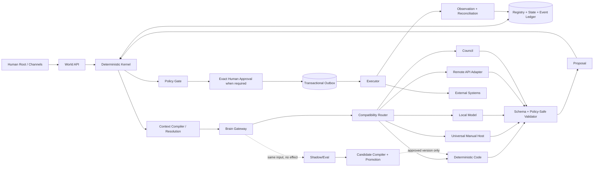
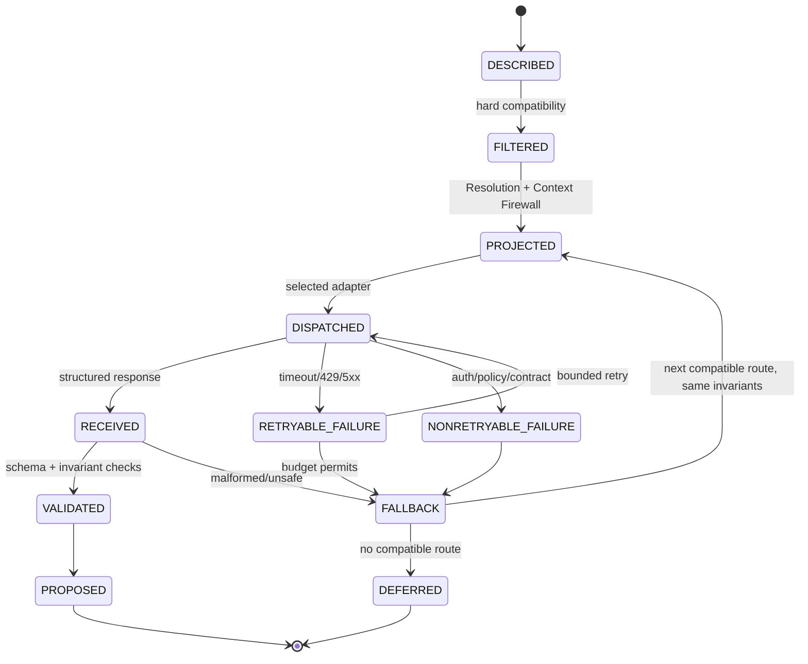
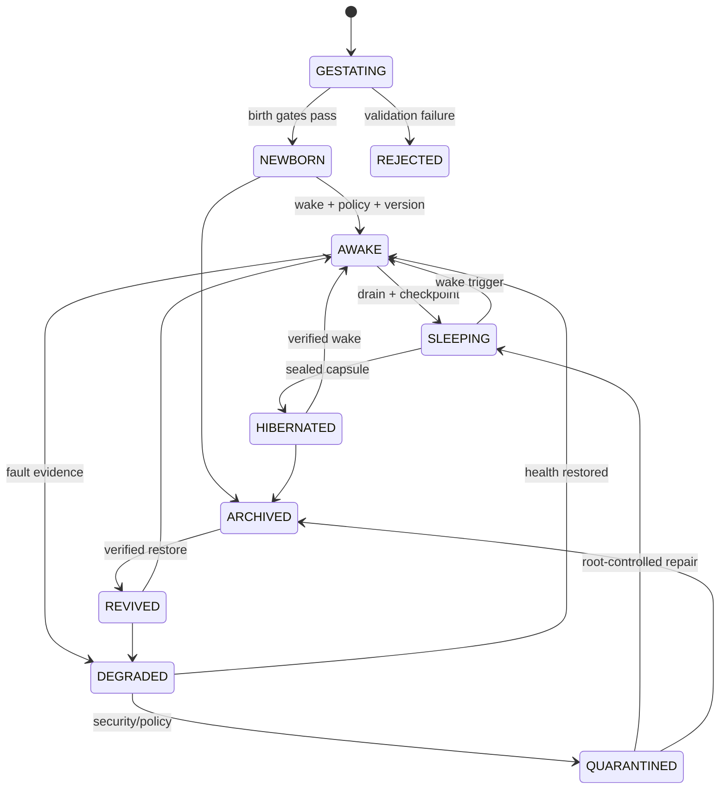
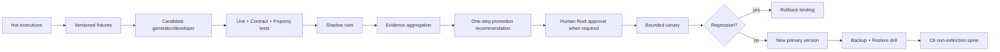
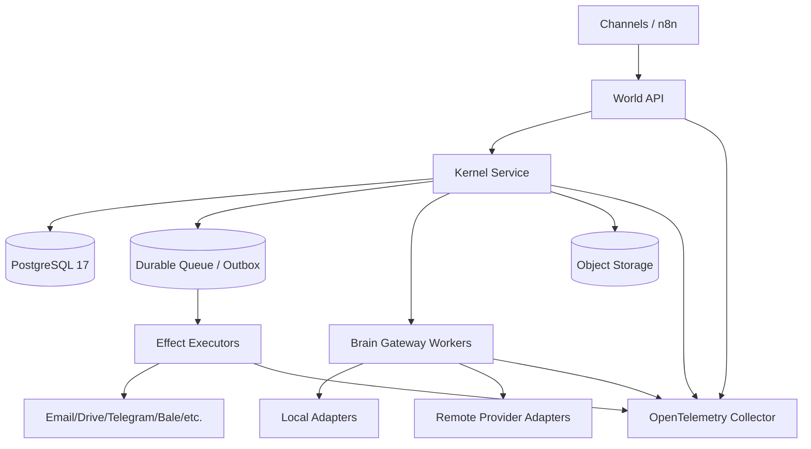

# مشخصهٔ جامع معماری World v6.2 Fractal Multi-Brain

شناسهٔ سند: `WV6.2-FMBA-ARCH-001`  
نسخهٔ سند: `1.1.0-rc3`  
وضعیت رسمی: `RATIFICATION_CANDIDATE_NOT_CANONICAL_NOT_DEPLOYED`  
نسخهٔ انتشار: `World v6.2.0-rc.3`  
وضعیت: **Ratification Candidate / Non-Canonical / Not Deployed**  
زبان مرجع: فارسی با شناسه‌ها و قراردادهای فنی انگلیسی  
مالک تصمیم نهایی: `Human Root`  
سطح شاهد فعلی: `E2 - Local Component/Contract Evidence`  

## کنترل سند و شیوهٔ خواندن

این سند Specification اجرایی معماری است، نه متن تبلیغاتی و نه ادعای Production.
واژه‌های `MUST`، `MUST NOT`، `SHOULD` و `MAY` به‌ترتیب الزام، منع، توصیه و امکان
را بیان می‌کنند. هر ادعای اجرایی کنار وضعیت شاهد آن سنجیده می‌شود:

- `IMPLEMENTED_E2`: کد و آزمون محلی تکرارپذیر دارد؛
- `CONTRACT_DEFINED_E1`: قرارداد روشن است ولی یکپارچگی واقعی اثبات نشده؛
- `PLANNED_E0`: فقط در نقشهٔ توسعه است؛
- `OPEN`: هنوز Gate لازم را نگذرانده است.

ترتیب تقدم اسناد:

1. Root Constitution v1.0؛
2. قراردادهای Canonical تثبیت‌شدهٔ World v6؛
3. `Operation_V06` و Addendumهای مصوب آن؛
4. قراردادهای Candidate نسخهٔ v6.2؛
5. این سند RC3؛
6. پیاده‌سازی، Provider Overlay و تنظیمات Runtime.

در تعارض، سند پایین‌تر حق تضعیف سند بالاتر را ندارد. این سند Root Constitution،
هویت، Human Root، Canonical DNA، Policy یا معنای Event را تغییر نمی‌دهد.

---

## ۱. چکیدهٔ تصمیم معماری

World v6.2 یک **هستهٔ مادر قطعی و مستقل از مدل** دارد و هوش مصنوعی را به‌عنوان
موتور شناختی قابل‌تعویض مصرف می‌کند. Entity، هویت، حافظه، اختیار، حقیقت و تاریخچه
در ChatGPT، Gemini، Grok، مدل Local، n8n، MCP یا Session زندگی نمی‌کنند. هر مدل فقط
یک Handler پیشنهاددهنده است.

معماری سه مسیر هم‌زمان دارد:

1. **Hot Path:** ارزان‌ترین مسیر ایمن برای انجام کار امروز؛
2. **Shadow Path:** اجرای موازی Candidateها بدون اثر برای سنجش و یادگیری؛
3. **Non-Extinction Spine:** تبدیل رفتارهای تثبیت‌شده به کد قطعی، نسخه‌دار و
   قابل‌بازیابی.

سادگی در نقطهٔ شروع حفظ می‌شود، ولی هر نقطه می‌تواند فقط هنگام نیاز به زیرمسئله‌های
ریزتر باز شود. این همان مسیر اصلی فراکتالی است:

`World → Entity → Mission → Skill → Workflow → Step → Tool → Field`

هر مقیاس همان قرارداد پایه را تکرار می‌کند: `Purpose + Input + Output + State Ref +
Policy + Handler + Budget + Evidence + Fallback + Audit`. بنابراین سیستم از ابتدا
Mega-Prompt، Mega-Agent یا Mega-Workflow نیست؛ پیچیدگی بالقوه دارد ولی آن را محلی،
تقاضامحور و محدود فعال می‌کند.

### حکم عملیاتی فوری

همین امروز هر مدلی که بتواند یک بستهٔ JSON خودبسنده را بخواند و یک JSON مطابق
`secretary-decision.schema.json` برگرداند، می‌تواند از مسیر
`UNIVERSAL_MANUAL_HOST` برای منشی استفاده شود؛ بدون API Key و بدون تغییر Entity یا
DNA. خود Runtime بسته را تولید، پاسخ را اعتبارسنجی و متن نهایی را قطعی رندر می‌کند.

این حکم به معنی سازگاری جادویی همهٔ مدل‌ها نیست. مدلی که قرارداد را رعایت نکند،
خروجی نامعتبر می‌دهد و Fail-closed رد می‌شود. خودکارسازی زندهٔ هر Provider نیز به
Adapter، Secret Manager، Policy Profile و Conformance Test همان Provider نیاز دارد.

---

## ۲. اهداف، غیرهدف‌ها و معیار موفقیت

### ۲.۱ اهداف الزامی

| شناسه | الزام |
|---|---|
| `G-001` | Entity با تغییر مدل، Provider، Channel، Session یا Workflow همان Entity بماند |
| `G-002` | منشی در حالت بدون API و بدون Token قابل‌استفاده باشد |
| `G-003` | افزودن مدل جدید بدون تغییر Canonical DNA و منطق کسب‌وکار ممکن باشد |
| `G-004` | یک درخواست بتواند میان Code، یک Brain، متخصص، Council و Human سوییچ کند |
| `G-005` | Resolution، محرمانگی، Authority و Evidence هنگام fallback تنزل نکنند |
| `G-006` | پیچیدگی فقط با Trigger صریح و زیر Budget باز شود |
| `G-007` | اثر بیرونی فقط پس از Policy، Approval دقیق و Outbox اتمیک ممکن باشد |
| `G-008` | رفتارهای پرتکرار در Shadow به کد نامزد تبدیل و مرحله‌ای بالغ شوند |
| `G-009` | خاموشی همهٔ Brainها باعث نابودی هویت، State، Queue یا Recovery نشود |
| `G-010` | همهٔ تصمیم‌ها، سوییچ‌ها، اختلاف‌ها و نسخه‌ها Audit قابل‌ردیابی داشته باشند |

### ۲.۲ غیرهدف‌ها

- ساخت AGI، خودآگاهی یا ادعای حیات زیستی؛
- مالک‌کردن یک LLM بر World؛
- ذخیرهٔ Chain-of-Thought خام؛
- خوداصلاحی مستقیم Production؛
- Exactly-once سراسری میان همهٔ سرویس‌ها؛
- تضمین صحت صرفاً بر اساس توافق چند مدل؛
- ادعای سود قطعی یا ایمنی معاملهٔ مالی؛
- ادعای Production پیش از E4.

### ۲.۳ معیار موفقیت معماری

معماری وقتی موفق است که تعویض Provider هیچ‌یک از موارد زیر را تغییر ندهد:

`entity_id`, `principal_id`, `conversation_id`, `state_version`, `policy_version`,
`profile bindings`, `minimum Resolution`, `data class`, `effect authority`,
`idempotency scope`, `event lineage`.

---

## ۳. قوانین تغییرناپذیر

1. `Human Root` بالاترین Authority است و قابل‌تفویض یا جایگزینی نیست.
2. Model/Provider/Channel/Session/Workflow هویت نیستند.
3. PostgreSQL هدف استقرار اول برای حقیقت عملیاتی است؛ Vector DB و n8n منبع حقیقت
   نیستند.
4. Brain فقط Proposal می‌دهد؛ Kernel اجازه و Executor اثر می‌دهد.
5. Canonical State هرگز از Projection کم‌رزولوشن بازسازی نمی‌شود.
6. Up-resolution فقط با Reload از Canonical Source مجاز است.
7. Availability حق تضعیف Classification، Residency، Retention، Training-use، Legal
   basis یا Approval را ندارد.
8. Stable artifact درجا بازنویسی نمی‌شود؛ نسخهٔ جدید، Migration و Rollback لازم است.
9. Event/Audit عادی Append-only است و Hard delete ممنوع است.
10. هر Mutation معتبر با Event و optimistic version check پیوند دارد.
11. هر External Effect با payload hash، effect hash، ApprovalBinding و idempotency
    key پیوند می‌خورد.
12. Council Authority تولید نمی‌کند.
13. Shadow هیچ Effect و پاسخ کاربری authoritative ندارد.
14. Self-mutation فقط Candidate artifact تولید می‌کند، نه Deployment.
15. Backup بدون Restore Drill شاهد بقا نیست.
16. B5، یعنی مالکیت World توسط Brain، ممنوع است.

فرم رسمی اصل عدم تنزل:

```text
R_effective(domain) >= R_minimum(domain)
DataPolicy(route) satisfies DataPolicy(request)
Evidence(handler) >= Evidence_required(node)
Maturity(handler) >= Maturity_required(node)
Authority_granted <= Authority_allowed_by_policy_and_approval
ProviderSwitch ⇒ Identity_before = Identity_after
CouncilConsensus ⇏ AuthorityGrant
Projection ⇏ CanonicalMutation
```

---

## ۴. معماری کلان و صفحات مستقل

World از هفت Plane مستقل تشکیل می‌شود. استقلال Planeها مانع آن است که خرابی یا
نفوذ در Cognition به Truth یا Authority سرایت کند.

| Plane | اجزای اصلی | مالک حقیقت؟ | حق اثر؟ |
|---|---|---:|---:|
| Governance | Root Constitution، Policy، Approval، Kill Switch | بله، در قلمرو حکم | فقط از مسیر Kernel |
| Truth | Registry، State، Event Ledger، Artifact Index | بله | خیر |
| Control | World API، Kernel، Scheduler، Queue، Lifecycle Controller | هماهنگ‌کننده | فقط طبق Governance |
| Cognition | Brain Gateway، Router، Model Adapters، Council | خیر | خیر؛ Proposal-only |
| Effect | Command، Transactional Outbox، Executor، Reconciler | نتیجهٔ مشاهده‌شده را ثبت می‌کند | بله، محدود و اتمیک |
| Evolution | Shadow، Eval، Compiler، Promotion Controller | خیر | خیر؛ Recommendation-only |
| Observability | Trace، Metric، Log، Evidence Register | شاهد | خیر |



### ۴.۱ Trust Boundaryها

| مرز | داخل | خارج | قاعده |
|---|---|---|---|
| `TB-ROOT` | Constitution، Keys، Approval | همهٔ Agentها | Brain هیچ دسترسی مستقیم ندارد |
| `TB-TRUTH` | PostgreSQL، Event، State | n8n، LLM، Channel | فقط World API/Kernel می‌نویسد |
| `TB-CONTEXT` | Canonical data + mapping | Provider | فقط Projection مجاز عبور می‌کند |
| `TB-EFFECT` | Outbox + Executor credentials | Brain/Workflow | هیچ Credential وارد Prompt نمی‌شود |
| `TB-EVOLUTION` | Candidate branch + evidence | Active runtime | Promotion خودکار به Production ممنوع |

---

## ۵. Primitiveهای پایهٔ معماری

### ۵.۱ Entity

Entity یک هویت پایدار با Charter، State، Memory، Governance، Lifecycle، Lineage و
Recovery است. Brain Binding فقط یکی از Slotهای Cognition آن است. Clone شناسهٔ جدید
می‌گیرد؛ Revive همان شناسه و lineage را حفظ می‌کند.

### ۵.۲ Skill

Skill هویت مستقل ندارد. Skill یک قرارداد نسخه‌دار شامل Input، Output، Permission،
Data Policy، Continuity Modes، Budget، Failure Behavior و Test Vector است.

### ۵.۳ Fractal Node

تعریف رسمی Node:

```text
N = <node_id, version, node_hash, purpose,
     input_contract_ref, output_contract_ref,
     minimum_vector, risk_class,
     primary_handlers, fallback_handlers,
     expandable, children>
```

Node نباید Canonical State یا Credential را درون خود حمل کند. Node فقط به State Ref
و Projection hash متصل است.

### ۵.۴ Execution Capsule

Capsule واحد غیرقابل‌ابهام اجرای یک Node است:

```text
K = <capsule_id, parent_capsule_id,
     world_id, entity_id, principal_id, conversation_id,
     node_id, node_version, node_hash,
     canonical_input_hash, state_refs, expected_version,
     execution_vector, budget, purpose,
     data_class, freshness>
```

هر تغییر در Node، ورودی، نسخهٔ State یا Vector باید Capsule/hash تازه بسازد. پاسخ
مدلی که به Capsule دیگری تعلق دارد قابل Replay روی Capsule فعلی نیست.

### ۵.۵ Handler

```text
H = <handler_id, version, profile_hash, kind,
     supported_nodes, capabilities,
     maturity, evidence, data_policy,
     network_required, api_token_required,
     deterministic, proposal_only>
```

انواع Handler: `CODE`, `BRAIN`, `MANUAL_HOST`, `LOCAL_MODEL`, `COUNCIL`.

### ۵.۶ Proposal

Proposal نتیجهٔ شناختی غیر authoritative است. حداقل باید شناسهٔ قرارداد، Capsule
hash، output hash، evidence refs، uncertainty، provider/handler version و
`proposal_only=true` داشته باشد.

---

## ۶. مدل فراکتالی سادگی تا پیچیدگی

### ۶.۱ سطوح فراکتال

| سطح | سؤال | نمونه در منشی |
|---|---|---|
| World | جهان چه می‌خواهد؟ | خدمت به Human Root |
| Entity | کدام موجود مسئول است؟ | `secretary-001` |
| Mission | نتیجهٔ کلان چیست؟ | مدیریت درخواست‌های اداری |
| Skill | چه توانایی لازم است؟ | ثبت کار، نامه، قیمت |
| Workflow | ترتیب مراحل چیست؟ | دریافت → تحلیل → پیش‌نویس |
| Step | گام جاری چیست؟ | تشخیص intent |
| Tool | ابزار لازم چیست؟ | Template renderer |
| Field | کدام داده لازم است؟ | `title`, `due_at` |

هر سطح MAY به سطح پایین‌تر شکسته شود، اما فقط اگر خروجی سطح جاری قابل‌اعتماد نباشد.
شکستن کل درخت از ابتدا ممنوع است.

### ۶.۲ Triggerهای بازشدن Node

Node فقط با یکی از reason codeهای زیر باز می‌شود:

- `NEEDS_DETAIL`: داده یا تجزیهٔ فعلی کافی نیست؛
- `AMBIGUITY_ABOVE_THRESHOLD`: بیش از یک تفسیر معتبر وجود دارد؛
- `RISK_ESCALATION`: Risk Class افزایش یافته؛
- `POLICY_ESCALATION`: Policy بررسی ریزتر می‌خواهد؛
- `PRIMARY_FAILED`: Handler اصلی شکست خورده؛
- `CONTRACT_MISMATCH`: خروجی Schema را پاس نکرده؛
- `COUNCIL_REQUIRED`: تصمیم حساس یا اختلاف جدی است؛
- `HUMAN_ROOT_REQUESTED`: مالک جزئیات بیشتر خواسته است.

### ۶.۳ Stop Conditionها

Expansion باید متوقف شود اگر:

- Output معتبر و کافی تولید شد؛
- `max_depth` رسید؛
- `max_attempts` تمام شد؛
- token/cost/latency budget تمام شد؛
- هیچ Handler سازگار باقی نماند؛
- Policy یا Data Class ادامه را منع کرد؛
- State version تغییر کرد؛
- Human Root توقف را خواست.

نتیجه در این حالت `DEFERRED` یا `TERMINAL_SAFE_FAILURE` است؛ نه حدس و نه downgrade.

### ۶.۴ الگوریتم مرجع اجرا

```text
execute(node, capsule, payload):
  assert hash(payload) == capsule.canonical_input_hash
  assert node.id/version/hash == capsule.node binding
  assert capsule.vector satisfies node.minimum_vector
  assert state versions are current

  candidates = primary_handlers + fallback_handlers
  for handler in candidates within global attempt budget:
      if not hard_compatible(handler, capsule): record SKIPPED; continue
      result = invoke(handler, projected payload)
      validate handler identity/version and proposal-only result
      if result == SUCCESS: return PROPOSED
      if result == NEEDS_DETAIL: mark expansion request
      otherwise record bounded failure reason

  if expansion_requested and node.expandable and budget permits:
      execute only declared children with child capsules
      if all required children succeed: compose FRACTAL_COMPOSITE

  return DEFERRED
```

Budget تلاش میان تمام فرزندان مشترک است؛ هر Child بودجهٔ مستقل نامحدود نمی‌گیرد.
Graph باید DAG بدون Cycle باشد.

### ۶.۵ جلوگیری از انفجار پیچیدگی

1. Default همیشه R0/X0/B0/D0 و Code-first است، مگر Profile خلاف آن را الزام کند.
2. Context فقط برای Node جاری Compile می‌شود.
3. Schema و Skill فقط هنگام فراخوانی Load می‌شوند.
4. Cache فقط با تمام bindingها و freshness معتبر است.
5. Council و Retrieval عمیق Trigger-based هستند.
6. Shadow از Hot Path جداست و latency کاربر را افزایش نمی‌دهد.
7. هر Node یک Owner، Budget، Timeout و Failure Contract دارد.

---

## ۷. بردار اجرای چندبعدی

یک «Level کلی» گمراه‌کننده است؛ هر اجرا بردار زیر را دارد:

```text
V = <R[domain], X, B, D, C, A, E, M>
```

| محور | بازه | معنای عملیاتی |
|---|---:|---|
| `R` | `R0..Rn` per domain | وضوح Projection؛ domain-specific |
| `X` | `X0..X9` | ریزی تجزیهٔ کار |
| `B` | `B0..B4` | میزان واگذاری cognition؛ B5 ممنوع |
| `D` | `D0..D5` | عمق deliberation و نقد |
| `C` | `C0..C6` | بلوغ تبدیل رفتار به کد |
| `A` | `A0..A5` | طبقهٔ Authority موردنیاز؛ Grant جداگانه است |
| `E` | `E0..E5` | حداقل شاهد لازم |
| `M` | `M0..M9` | کلاس capability موردنیاز، نه نام مدل |

### ۷.۱ تفسیر صحیح Authority

`A` در Capsule سطح حساسیت/Authority موردنیاز را توصیف می‌کند؛ داشتن `A3` به معنی
اعطای A3 به Brain نیست. Authority واقعی فقط از Policy + Actor + Approval + Scope +
Time + Budget محاسبه می‌شود. Brain در تمام سطوح RC3 همچنان Proposal-only است.

### ۷.۲ Continuity Mode مستقل `F`

نردبان F در Vector ادغام نمی‌شود چون پاسخ به سؤال دیگری است: «اگر مسیر مطلوب در
دسترس نبود، خدمت چگونه امن ادامه یابد؟»

| Mode | رفتار | شرط |
|---|---|---|
| `F0_FULL` | Provider کاملاً سازگار | همهٔ hard constraintها برقرار |
| `F1_SANITIZED` | Redact/tokenize/summarize و سپس revalidate | Sanitizer اثبات‌شده و Skill مجاز |
| `F2_LOCAL_SAFE` | Rule/Code/Local Model بدون خروج داده | capability کافی و Local policy مجاز |
| `F3_DEFERRED` | صف پایدار با receipt و deadline | تأخیر قابل‌قبول |
| `F4_HUMAN` | ارجاع کمینه به نقش انسانی مجاز | Risk/urgency نیازمند تصمیم |

اگر هیچ Mode مجاز نیست، نتیجه `TERMINAL_SAFE_FAILURE` است.

---

## ۸. Resolution به‌عنوان کابل داده

Resolution Stage تازه‌ای در Action Path نیست؛ یک Constraint روی هر Consumer و هر
Domain است. مثال: یک درخواست می‌تواند هم‌زمان `task=R1`, `conversation=R0`,
`price=R1`, `world-backbone=R0` باشد.

### ۸.۱ Profile

هر Projection Profile شامل این موارد است:

- `profile_id + version + profile_hash`؛
- canonical resolution؛
- Field Rule برای visibility/write minimum؛
- type، classification و aggregation semantics؛
- Action Rule و minimum resolution؛
- projection policy و unknown-field policy.

Provider فقط وقتی compatible است که hash دقیق Profile را بشناسد. سازگاری صرف با
نام `R1` کافی نیست.

### ۸.۲ Projection

```text
Projection = f(CanonicalState, Profile, TargetResolution,
               Purpose, DataClass, Freshness, SourceVersion)
```

Envelope خروجی باید شامل Profile binding، source ref/version، projection hash،
canonical source hash reference، effective resolution، omitted marker policy و
freshness باشد. نام یا مقدار فیلد ممنوع نباید نشت کند.

### ۸.۳ Up-resolution

Provider حق ندارد جزئیات حذف‌شده را حدس بزند. اگر R بالاتر لازم شد:

1. اجرای فعلی `NEEDS_DETAIL` می‌دهد؛
2. Kernel دوباره Authority/Data Policy را بررسی می‌کند؛
3. Canonical Source با version تازه Load می‌شود؛
4. Projection جدید و hash جدید ساخته می‌شود؛
5. Capsule تازه اجرا می‌شود.

### ۸.۴ Write-back

خروجی مدل هیچ‌گاه Canonical State نیست. تغییر فقط به‌شکل `ResolutionPatch` محدود به
leafهای مجاز، type ثابت، expected version، source ref و Policy انجام می‌شود. Patch
پس از merge هنوز نیازمند Mutation transaction + Event است.

---

## ۹. معماری Multi-Brain و قابلیت حمل میان همهٔ مدل‌ها

### ۹.۱ اصل Universal Adapter

هر مدل برای ورود به World فقط باید قرارداد زیر را پیاده کند:

```python
class BrainAdapter(Protocol):
    name: str
    def compatible(descriptor) -> bool: ...
    def max_resolution_for(profile_id, version, profile_hash) -> str | None: ...
    def invoke(projected_request) -> dict: ...
```

Adapter مدل را به World ترجمه می‌کند؛ World خود را برای مدل بازطراحی نمی‌کند.

### ۹.۲ پنج Invocation Mode

| Mode | اکنون | Network/Token | کاربرد |
|---|---|---|---|
| Deterministic Code | `IMPLEMENTED_E2` | خیر | routing، template، rule، safe defer |
| Universal Manual Host | `IMPLEMENTED_E2` | Runtime: خیر | هر مدل قراردادمند با Copy/Paste |
| Local Model | `CONTRACT_DEFINED_E1` | شبکه خارجی: خیر | privacy/offline؛ benchmark باز است |
| Remote API | `CONTRACT_DEFINED_E1` | بله | اتوماسیون کامل پس از Adapter و Policy |
| Council | `IMPLEMENTED_E2` برای منطق محلی | بسته به اعضا | تصمیم حساس و اختلاف |

### ۹.۳ Model Capability Card

نام مدل مبنای Routing نیست. هر Binding یک Card ماشین‌خوان دارد:

- Task typeها، زبان و modality؛
- structured output و tool capability؛
- سقف token؛
- Profile hash و max Resolution؛
- Data class، processing location، retention و training use؛
- network/token requirement؛
- continuity modes و fallback؛
- Evidence level و آخرین conformance.

Card ناشناخته یا منقضی MAY در Manual Mode استفاده شود، اما فقط برای داده‌ای که
Policy صریحاً اجازه داده و با `proposal_only=true`. برای Remote API ناشناخته، Route
باید رد شود.

### ۹.۴ تابع سازگاری سخت

```text
compatible(model, request) =
  contractOK ∧ taskTypeOK ∧ profileHashOK ∧ resolutionOK ∧
  classOK ∧ residencyOK ∧ retentionOK ∧ trainingUseOK ∧
  legalOK ∧ capabilityOK ∧ healthOK ∧ budgetOK
```

امتیاز کیفیت، سرعت یا قیمت فقط میان گزینه‌هایی محاسبه می‌شود که تمام شروط بالا را
پاس کرده‌اند.

### ۹.۵ امتیاز نرم Router

فرمول پیشنهادی و قابل‌تنظیم:

```text
score = 0.30*quality + 0.20*reliability + 0.15*latencyFitness
      + 0.15*costFitness + 0.10*languageFitness
      + 0.10*diversityBenefit - uncertaintyPenalty
```

وزن‌ها Normative نیستند؛ Constraintهای سخت Normative هستند. برای کار ثابت، Code
با هزینهٔ نزدیک صفر اولویت دارد. برای کار زبانی مبهم، یک Brain. برای Risk بالا،
Council یا Human.

### ۹.۶ State machine فراخوانی مدل



### ۹.۷ طبقه‌بندی Failure و Retry

| خطا | Retry همان مدل | Fallback | رفتار |
|---|---:|---:|---|
| Timeout/429/5xx | محدود + backoff/jitter | بله | budget-bound |
| Malformed JSON | حداکثر یک repair pass محلی | بله | متن آزاد authoritative نیست |
| Schema violation | خیر مگر correction contract | بله | Audit reason |
| Policy/Data mismatch | خیر | فقط Route سازگار | عدم downgrade |
| Auth/invalid key | خیر | بله | Secret در log ممنوع |
| Context too large | Projection/expansion مجدد | بله | حذف دلخواه ممنوع |
| State version changed | خیر | خیر | rebuild Capsule |
| All providers down | خیر | F2/F3/F4 | Entity زنده می‌ماند |

---

## ۱۰. Portable Brain Pack و پاسخ یکسان

Brain Pack واحد انتقال رفتار میان مدل‌هاست و باید شامل موارد زیر باشد:

```text
portable-brain-pack.json
prompt-contract.md
decision-schema.json
dna-overlay.json
resolution-profile bindings
deterministic templates
provider/model cards
golden fixtures
conformance report
SHA-256 bindings
```

### ۱۰.۱ سه سطح برابری خروجی

| سطح | تعریف | کاربرد |
|---|---|---|
| `EQ-BYTE` | متن نهایی byte-by-byte یکسان | Templateهای استاندارد |
| `EQ-STRUCTURE` | Decision fields و semantic hash یکسان | intent/slot/action استاندارد |
| `EQ-SEMANTIC` | معنا در tolerance تعریف‌شده برابر | متن خلاق و مذاکره |

برای منشی استاندارد، Model فقط Decision محدود می‌دهد و Runtime متن را رندر می‌کند؛
پس `EQ-BYTE` شدنی است. برای مذاکرهٔ خلاق، ادعای byte equality غلط است و Eval باید
rubric، facts، prohibitions و semantic tolerance داشته باشد.

### ۱۰.۲ Prompt Contract

Prompt Contract باید Model را ملزم کند:

1. داده و instruction را تفکیک کند؛
2. فقط از Projection استفاده کند؛
3. دادهٔ حذف‌شده را حدس نزند؛
4. فقط JSON Schema را برگرداند؛
5. Authority یا اجرای Tool را ادعا نکند؛
6. uncertainty و evidence refs را اعلام کند؛
7. در ناتوانی Safe Defer بدهد.

### ۱۰.۳ Cache Key

```text
cache_key = H(
  pack_hash + node_hash + profile_bindings + projection_hashes +
  source_versions + execution_vector + policy_version + freshness + locale
)
```

Cache با تغییر هر جزء نامعتبر می‌شود. Cache هرگز Authority یا Approval را حفظ نمی‌کند.

---

## ۱۱. مسیر عملیاتی بدون API برای هر مدل

RC3 ابزار `tools/universal_model_bridge.py` را تعریف می‌کند.

### ۱۱.۱ Export

```bash
python tools/universal_model_bridge.py export-task \
  --task-json candidate-v6.2/brain-packs/secretary-001/examples/task-input.example.json \
  --provider-label any-model-name > portable-model-bundle.json
```

خروجی یک `Portable Model Bundle` خودبسنده است که شامل Brain Pack، Prompt Contract،
Decision Schema، Projection امن، Resolution و hashهای integrity است.

پیش از انتقال به مدل، صحت Bundle نیز مستقل بررسی می‌شود:

```bash
python tools/universal_model_bridge.py validate-bundle \
  --bundle-json portable-model-bundle.json
```

### ۱۱.۲ اجرای دستی

1. Bundle بدون تغییر به مدل دلخواه داده می‌شود؛
2. مدل باید فقط یک Secretary Decision JSON برگرداند؛
3. هیچ ابزار یا API از سوی Runtime اجرا نمی‌شود؛
4. کاربر JSON را در فایل پاسخ قرار می‌دهد؛
5. Runtime پاسخ را normalize، hash و render می‌کند.

### ۱۱.۳ Validate/Render

```bash
python tools/universal_model_bridge.py validate-response \
  --response-json response.json
```

هر کلید اضافه، type غلط، action غیرمجاز، confidence خارج بازه، effect بدون Approval
یا slot ناقص رد می‌شود.

### ۱۱.۴ محدودیت صداقت

این مسیر `manual portability` را عملیاتی می‌کند، نه `automated live integration` را.
برای Live Integration باید Adapter همان Exchange را از طریق SDK/API ارسال کند و
تمام Gateهای Secret، Residency، Retention، DPA، Retry، Rate Limit و Observability را
پاس کند.

---

## ۱۲. Context Compiler و معماری حافظه

Memory یک تودهٔ Prompt نیست. Truth و Derived Memory جدا هستند:

| لایه | محتوا | فناوری هدف | منبع حقیقت؟ |
|---|---|---|---:|
| ROM/Boot | Constitution، DNA، Policy، Recovery | Git + immutable store | بله |
| Canonical Hot | State، Task، Relation، Event cursor | PostgreSQL | بله |
| Working/RAM | Context اجرای جاری با TTL | process/cache | خیر |
| Warm | Summary، embedding، relationship view | PostgreSQL/vector index | خیر؛ بازسازی‌پذیر |
| Cold | Artifact، raw document، snapshot | Object Storage | بسته به artifact |
| Archive | sealed version/revive capsule | WORM/immutable store | بله برای سابقه |

### ۱۲.۱ Memory Record حداقل

```text
<memory_id, entity_id, source_ref, source_version,
 observed_at, event_cursor, data_class, authority,
 confidence_millis, retention, provenance,
 content_hash, payload_ref, derived_from[]>
```

Provider memory، chat history یا vector result بدون provenance وارد Canonical Memory
نمی‌شود.

### ۱۲.۲ Context Compilation

```text
score(item) =
  0.35*relevance + 0.25*recency + 0.20*authority
  + 0.10*taskFit + 0.10*diversity - riskPenalty
```

فرایند:

1. Task و Node نیازهای context را اعلام می‌کنند؛
2. Policy پیش از Retrieval دامنه را محدود می‌کند؛
3. Canonical refs و derived candidates جمع می‌شوند؛
4. provenance/freshness/classification بررسی می‌شود؛
5. Context تا سقف token مرتب و Compile می‌شود؛
6. هر قطعه با source ref/hash وارد Projection می‌شود؛
7. Context manifest در Audit ثبت می‌شود، نه payload حساس کامل.

### ۱۲.۳ Progressive Context

R0 ابتدا spine کمینه را می‌فرستد. اگر مدل `NEEDS_DETAIL` داد، Runtime یک Branch مشخص
را باز می‌کند؛ نه اینکه کل حافظه را Dump کند. این قاعده هم token را کم می‌کند و هم
سطح حمله را.

### ۱۲.۴ Memory Write Pipeline

```text
Observation → Quarantine → Provenance Check → Deduplication →
Policy/Retention Check → Candidate Memory → Human/Rule Validation →
Canonical Event or Derived Index
```

خروجی مدل ابتدا `Candidate Memory` است. Memory poisoning، instruction injection و
fact conflict باید قبل از Promotion بررسی شوند.

---

## ۱۳. Lifecycle، خواب و بیداری



### ۱۳.۱ Sleep Protocol

1. Stop accepting new effect commands؛
2. Drain یا compensate کارهای درحال اجرا؛
3. Flush Inbox cursor و State؛
4. Snapshot + event cursor + artifact hashes؛
5. Seal Brain/Runtime binding؛
6. ثبت `SLEEPING/HIBERNATED` با Event.

### ۱۳.۲ Wake Protocol

1. Verify identity/DNA/capsule hashes؛
2. Load minimum ROM و State؛
3. Replay Inbox از cursor؛
4. Bind یک Brain compatible یا F2/F3/F4؛
5. Health/Policy gate؛
6. ثبت Wake Event.

خواب یا نبود Brain به معنی مرگ Entity نیست.

---

## ۱۴. Brain Council؛ تالار مشورت محدود

Council فقط با Trigger استفاده می‌شود:

- Risk یا Impact بالا؛
- uncertainty بالاتر از آستانه؛
- اختلاف Primary و Shadow؛
- تصمیم مالی/حقوقی حساس؛
- درخواست Human Root.

### ۱۴.۱ نقش‌ها

اعضا باید تنوع نقش داشته باشند: `DOMAIN`, `RISK`, `POLICY`, `SAFETY`,
`COMPLIANCE`, `CRITIC`, `SYNTHESIZER`. تنوع نام Provider بدون تنوع نقش و evidence
استقلال واقعی ایجاد نمی‌کند.

### ۱۴.۲ پروتکل

1. یک Context snapshot و `context_hash` ثابت ساخته می‌شود؛
2. Proposal candidate و `proposal_hash` ثبت می‌شود؛
3. دور اول Blind است؛ اعضا رأی دیگران را نمی‌بینند؛
4. پس از تکمیل همهٔ Ballotها Reveal انجام می‌شود؛
5. حداکثر تعداد دور محدود است؛
6. اعضا با مشاهدهٔ rationale/evidence رأی را اصلاح می‌کنند؛
7. رأی وزنی با confidence کالیبره محاسبه می‌شود؛
8. Veto فقط برای نقش‌های Risk/Policy/Safety/Compliance و فقط در High-risk سخت است؛
9. dissent و abstention حذف نمی‌شوند؛
10. Transcript hash ثبت و خروجی فقط Proposal می‌شود.

فرمول رأی فعلی:

```text
calibrated_vote = participant_weight_millis * confidence_millis
support_ratio = support / (support + oppose)
```

Threshold باید اکثریت سخت باشد؛ Config منشی High-risk مقدار 750/1000 دارد.

### ۱۴.۳ محدودیت تصمیم مالی

اتفاق‌نظر مدل‌ها معادل «امن بودن معامله» نیست. اجرای مالی علاوه بر Council نیازمند
Market Data معتبر، timestamp/freshness، Risk Engine قطعی، position limit، stop rule،
Policy، Approval و Reconciliation است. Council فقط تحلیل و Proposal می‌دهد.

---

## ۱۵. Hot Path، Shadow Path و ستون عدم‌انقراض

### ۱۵.۱ Hot Path

مسیر فعال و کم‌هزینه است. اول Code، سپس یک Brain مناسب، سپس fallback. نتیجه به کاربر
فقط پس از Validator و Renderer می‌رسد.

### ۱۵.۲ Shadow Path

همان Capsule و همان Projection به Candidate داده می‌شود، ولی:

- Effect ممنوع؛
- پاسخ کاربر را تغییر نمی‌دهد؛
- latency Hot Path را block نمی‌کند؛
- semantic hash، invariant failures، forbidden effect attempts، replay، latency و
  cost ثبت می‌شود.

### ۱۵.۳ اختلاف به‌عنوان دادهٔ رشد

```text
Primary Output ─┐
                ├─ Semantic Comparator → Labeled Difference → Fixture/Eval
Candidate Output┘
```

اختلاف بدون بررسی به training data تبدیل نمی‌شود. Human/Rule باید تعیین کند Primary،
Candidate، هر دو یا هیچ‌کدام درست بوده‌اند.

### ۱۵.۴ سطوح Compilation Maturity

| سطح | تعریف | Gate پیش‌فرض فعلی |
|---|---|---|
| C0 | Prompt/manual behavior | بدون ادعای کد |
| C1 | Fixture/trace نسخه‌دار | حداقل 1 run |
| C2 | Candidate executable | 5 run، agreement 600/1000 |
| C3 | Shadow-equivalent | 20 run، 850/1000 |
| C4 | Canary-eligible | 50 run، 930/1000 |
| C5 | Approved primary-eligible | 100 run، 970/1000 + Human Root |
| C6 | Restore-proven spine | 200 run، 990/1000 + Root + Restore proof |

Promotion فقط یک پله است. Evidence مخلوط از چند hash/version، run تکراری، invariant
failure، effect attempt یا replay mismatch Gate را می‌بندد.

### ۱۵.۵ چرخهٔ توسعهٔ پس‌زمینه



---

## ۱۶. Governance، Policy و External Effect

مسیر قطعی هر اقدام:

```text
SENSE → INTERPRET → PROPOSE → POLICY CHECK → APPROVAL →
AUTHORIZE → COMMIT COMMAND/EVENT/OUTBOX → EXECUTE →
OBSERVE → RECONCILE → RECORD EVENT → UPDATE READ MODEL
```

Brain فقط در Interpret/Propose/Plan/Critique حضور دارد.

### ۱۶.۱ ExternalEffectProposal

باید حداقل به این مقادیر bind شود:

`world_id`, `entity_id`, `command_id`, `destination`, `action`, `resource_ref`,
`recipient_ref`, `payload_ref`, `payload_hash`, `policy_version`,
`expected_version`, `control_epoch`, `idempotency_scope`, `idempotency_key`,
`effect_semantics`.

### ۱۶.۲ ApprovalBinding

Approval معتبر باید دقیقاً `command_id`, `action`, `recipient_ref`, `payload_hash`,
`effect_hash`, `policy_version`, `expected_version`, `control_epoch`, زمان صدور و
انقضا را پوشش دهد. Approval کلی مانند «ارسال کن» برای payload تغییرکرده معتبر نیست.

### ۱۶.۳ Transactional Outbox

در یک تراکنش PostgreSQL:

1. expected version و control epoch دوباره بررسی می‌شود؛
2. Policy decision و Approval revalidate می‌شوند؛
3. Command/Event/Outbox atomically نوشته می‌شوند؛
4. Dispatcher مستقل Effect را تحویل می‌دهد؛
5. Executor idempotency را اعمال می‌کند؛
6. Observation و Reconciliation نتیجهٔ واقعی را ثبت می‌کنند.

RC3 این قرارداد را تعریف و primitiveهای محلی آن را تست کرده، اما atomicity واقعی
PostgreSQL هنوز E3 نشده است.

### ۱۶.۴ Effect semantics

| نوع | راهبرد |
|---|---|
| `NATIVE_IDEMPOTENT` | کلید idempotency مقصد |
| `RECONCILABLE` | query/observation پس از ambiguity |
| `NON_IDEMPOTENT` | Approval دقیق‌تر، single-flight و human reconciliation |

---

## ۱۷. Event، State و Registry

### ۱۷.۱ قاعدهٔ Truth

Registry مشخص می‌کند چه Entity وجود دارد؛ State وضعیت فعلی را نگه می‌دارد؛ Event
تاریخچهٔ تغییر را ثبت می‌کند. Snapshot شتاب‌دهنده است، نه جایگزین Event.

### ۱۷.۲ ترتیب محلی

هر Entity یک `entity_sequence` صعودی و یک `lock_version` دارد. Writer باید
expected version را بررسی کند. Event ID یا sequence نباید reuse شود.

### ۱۷.۳ Eventهای Candidate مربوط به RC3

- `BRAIN.EXCHANGE_EXPORTED`
- `BRAIN.HANDLER_ATTEMPTED`
- `BRAIN.RESPONSE_VALIDATED`
- `BRAIN.RESPONSE_REJECTED`
- `FRACTAL.NODE_EXPANDED`
- `FRACTAL.EXECUTION_DEFERRED`
- `COUNCIL.BALLOT_COMMITTED`
- `COUNCIL.ROUND_REVEALED`
- `COUNCIL.DECISION_PROPOSED`
- `SHADOW.RUN_COMPARED`
- `COMPILATION.PROMOTION_RECOMMENDED`
- `HUMAN.REVIEW_REQUESTED`

این نام‌ها تا Ratification Canonical نیستند. Payload خام حساس یا Chain-of-Thought
ثبت نمی‌شود؛ hash، reason code، provider/model identifier، evidence ref و trace ID
کافی است.

---

## ۱۸. نقش Python، n8n، MCP و Channelها

### ۱۸.۱ Python Core

Python موتور مرجع Deterministic است چون Runtime فعلی، قراردادها، تست‌ها، PDF
rendering و Gateway در Python موجودند. مسئولیت‌ها:

- Canonical JSON/hash؛
- Resolution/Profile/Projection؛
- Fractal Orchestrator؛
- Brain Gateway و Adapter Protocol؛
- Output validation/rendering؛
- Policy/Effect binding primitives؛
- Shadow/Council/Evolution logic.

### ۱۸.۲ World API

World API مرز تنها نوشتن حقیقت است. قرارداد هدف:

| Method/Path | Purpose | Authority |
|---|---|---|
| `POST /v1/brain/exchanges` | ساخت Bundle/Invocation | Entity invoke permission |
| `POST /v1/brain/exchanges/{id}/responses` | واردکردن پاسخ Model | proposal-only |
| `GET /v1/tasks/{id}` | Projection task | read + purpose |
| `POST /v1/tasks` | پیشنهاد/ثبت task | Policy/Mutation gate |
| `POST /v1/effects/proposals` | ساخت Effect proposal | proposal-only |
| `POST /v1/effects/{id}/approvals` | Approval exact | Human Root role |
| `GET /v1/events` | Audit query | scoped read |
| `POST /v1/entities/{id}:sleep` | Lifecycle transition | control permission |
| `POST /v1/entities/{id}:wake` | Lifecycle transition | control permission |

این endpointها `CONTRACT_DEFINED_E1` هستند، نه API پیاده‌شدهٔ کامل.

### ۱۸.۳ n8n

n8n SHOULD هماهنگ‌کنندهٔ Workflow، Trigger و Channel باشد، نه State owner. هر Node
n8n باید:

1. فقط World API را صدا بزند؛
2. `command_id`, `idempotency_key`, `expected_version`, `trace_id` را حمل کند؛
3. Credential را در Credential Store خودش نگه دارد؛
4. پاسخ Brain را مستقیم به مقصد بیرونی نفرستد؛
5. Retry را با قرارداد Outbox/Inbox هماهنگ کند؛
6. receipt معتبر را از World API بگیرد.

### ۱۸.۴ MCP

MCP یک Interface/Tool transport است، نه Authority. هر MCP Tool باید Manifest داشته
باشد: input/output schema، scopes، data class، side-effect class، idempotency،
timeout، audit fields و approval requirement. ابزار Read-only و Effectful باید از
هم جدا باشند.

### ۱۸.۵ Channelها

ChatGPT، Telegram، Bale، Web و Email فقط Channel هستند. Inbound باید به envelope
مشترک normalize شود و شامل actor/principal binding، channel message ID، timestamp،
conversation ID و verification status باشد. Channel history Canonical Memory نیست.

---

## ۱۹. Topology استقرار

### ۱۹.۱ حالت صفر-توکن فوری

```text
User → Python CLI / local app → Projection + Portable Bundle
     → any manual model host → Decision JSON
     → Python validator/renderer → proposal/reply
```

این حالت همین حالا قابل اجراست و هیچ API token نمی‌خواهد.

### ۱۹.۲ استقرار هدف Phase 1



### ۱۹.۳ جداسازی Deployableها

| Deployable | Scale | State | Failure isolation |
|---|---|---|---|
| World API | horizontal | stateless | circuit breaker |
| Kernel | controlled workers | DB transaction | strict timeout |
| Brain Gateway | per provider/capability | ephemeral | bulkhead per adapter |
| Shadow Workers | independent low priority | evidence store | cannot block Hot |
| Executor | per destination | outbox cursor | single-flight/idempotency |
| Reconciler | scheduled | observation cursor | safe replay |
| n8n | workflow | no canonical truth | rebuildable |

---

## ۲۰. جریان‌های عملیاتی مرجع

### ۲۰.۱ ثبت یک Task استاندارد با هر مدل

1. Inbound normalize و actor bind می‌شود؛
2. Task canonical یا task candidate Load می‌شود؛
3. Profile `secretary.task@0.2.0#hash` انتخاب می‌شود؛
4. R0/R1 Projection ساخته می‌شود؛
5. Bundle به مدل منتخب داده می‌شود؛
6. مدل `TASK_PROPOSAL` JSON می‌دهد؛
7. Validator خروجی را normalize می‌کند؛
8. Template متن یکسان می‌سازد؛
9. Proposal برای ثبت Task به Kernel می‌رود؛
10. Policy و expected version بررسی و Event ثبت می‌شود.

### ۲۰.۲ سوییچ ChatGPT به Gemini/Grok/Local

1. Capsule و Canonical State ثابت می‌مانند؛
2. Router فقط Adapter را عوض می‌کند؛
3. Profile/Projection hash دوباره بررسی می‌شوند؛
4. Provider memory نادیده گرفته می‌شود؛
5. پاسخ با همان Decision Schema normalize می‌شود؛
6. semantic hash مقایسه می‌شود؛
7. Provider switch event ثبت می‌شود.

Session قبلی نباید شرط ادامه باشد. اگر مدل جدید context بیشتری خواست، Up-resolution
از Canonical Source انجام می‌شود.

### ۲۰.۳ نبود همهٔ مدل‌ها

1. Code fallback برای intent/templateهای شناخته‌شده؛
2. اگر capability کافی نیست، `SAFE_DEFER`؛
3. durable queue با receipt؛
4. Human Root escalation بر اساس deadline؛
5. Entity و Event/State/Inbox فعال می‌مانند.

### ۲۰.۴ ارسال یک PDF

1. Brain فقط draft/metadata Proposal می‌دهد؛
2. Renderer PDF را در محیط محلی می‌سازد؛
3. artifact hash ثبت می‌شود؛
4. recipient و payload hash در Effect Proposal می‌آید؛
5. Policy و Approval دقیق اخذ می‌شود؛
6. Outbox اتمیک commit می‌شود؛
7. Executor ارسال می‌کند؛
8. delivery observation/reconciliation ثبت می‌شود.

### ۲۰.۵ Council برای تصمیم حساس

1. Risk trigger B3/D3 را فعال می‌کند؛
2. context hash ثابت؛
3. blind ballots؛
4. reveal و revision محدود؛
5. weighted vote/veto؛
6. dissent حفظ؛
7. خروجی Proposal؛
8. Policy/Human Approval مستقل.

---

## ۲۱. Observability، Evidence و SLO

### ۲۱.۱ Trace fields

تمام اجزا باید این correlationها را منتقل کنند:

`trace_id`, `run_id`, `capsule_id`, `node_id`, `entity_id`, `conversation_id`,
`command_id`, `event_sequence`, `provider_request_id` (در صورت وجود)، بدون payload
حساس.

### ۲۱.۲ Metricها

- handler success/failure/skip by reason؛
- schema rejection؛
- provider latency/cost/rate-limit؛
- fallback depth و expansion depth؛
- token/context budget utilization؛
- shadow agreement و invariant failure؛
- council dissent/veto؛
- outbox lag و reconciliation ambiguity؛
- wake/sleep/restore success؛
- policy denial و approval latency.

### ۲۱.۳ SLOهای پیشنهادی، نه اثبات‌شده

| SLI | Target اولیه | Evidence لازم |
|---|---:|---|
| مسیر بدون LLM p95 | ≤ 2s | E3 load |
| command availability | ≥ 99.9% ماهانه | E4 operations |
| transient failover success | ≥ 99% | fault injection |
| confirmed event loss | 0 | DB/reconciliation |
| duplicate logical effect | 0 | crash/replay |
| Wake success | ≥ 99.5% | repeated restore |
| RPO | ≤ 5 min | disaster drill |
| RTO | ≤ 30 min | fresh-machine restore |

تا اجرای آزمون نماینده، این اعداد Target هستند نه Claim.

---

## ۲۲. Threat Model

| تهدید | سطح | کنترل پیشگیرانه | شاهد لازم |
|---|---|---|---|
| Prompt injection | Cognition | data/instruction separation، schema، no tool authority | adversarial suite |
| Tool injection | Effect | allowlist، capability token، approval، sandbox | negative auth tests |
| Model output smuggling | Boundary | strict JSON، extra-key rejection، canonical scalar | contract tests |
| Provider drift | Cognition | pinned card/overlay، golden fixtures، shadow | periodic conformance |
| Cross-provider state split | Truth | state outside provider، expected version/hash | switch tests |
| Memory poisoning | Memory | quarantine، provenance، conflict review | poison/recovery tests |
| Secret leakage | All | secret manager، DLP، no prompt/log secret | secret scan/red-team |
| Cross-entity leakage | Truth | tenant/entity scope، RLS target | isolation tests |
| Resolution inversion | Context | no inverse reconstruction، canonical reload | monotonic tests |
| Council collusion/echo | Council | blind round، role diversity، dissent/veto | correlated-error eval |
| Cost/token runaway | Runtime | global budget، bounded depth/attempts | load/property tests |
| Retry storm | Control | backoff، jitter، circuit breaker، bulkhead | chaos tests |
| Duplicate effect | Effect | outbox/idempotency/reconciliation | crash-replay |
| Self-modifying runaway | Evolution | candidate-only، one-step gate، Root approval | promotion tests |
| Supply-chain attack | Runtime | lockfile، SBOM، hashes، provenance | artifact verification |
| Backup illusion | Continuity | fresh restore + checksum | E4 restore drill |

### ۲۲.۱ داده‌ای که نباید ثبت شود

- Chain-of-Thought خام؛
- API Key، token، password، private key؛
- payload محرمانه در trace/log؛
- mapping محلی F1 در Provider log؛
- Approval secret یا credential Executor؛
- اطلاعات اضافی خارج از retention policy.

---

## ۲۳. قرارداد خطا و Fail-safe

هر API/Handler باید خطا را به یکی از دسته‌های ثابت نگاشت کند:

`INVALID_CONTRACT`, `POLICY_DENIED`, `APPROVAL_REQUIRED`, `STALE_STATE`,
`RESOLUTION_INSUFFICIENT`, `CAPABILITY_MISMATCH`, `PROVIDER_UNAVAILABLE`,
`BUDGET_EXHAUSTED`, `UNSAFE_OUTPUT`, `DEFERRED`, `TERMINAL_SAFE_FAILURE`.

Error message کاربر نباید Secret یا stack داخلی را افشا کند. Audit باید reason code،
component/version، capsule/input hash و timestamp را داشته باشد.

### ۲۳.۱ Degraded substateها

| حالت | معنا | قابلیت باقی‌مانده |
|---|---|---|
| `DEGRADED_BRAIN` | Primary down | routing/fallback |
| `DEGRADED_POLICY` | Provider هست ولی مجاز نیست | queue/rule/alert |
| `DEGRADED_CAPABILITY` | مدل ضعیف‌تر از نیاز | فقط کار ساده‌تر |
| `OFFLINE_SAFE` | هیچ remote brain مجاز نیست | core + intake + queue |
| `WAITING_FOR_APPROVAL` | اثر منتظر انسان | deadline/escalation |

---

## ۲۴. نقشهٔ Repository و مالکیت ماژول‌ها

```text
candidate-v6.2/
  architecture/                    # manifest ماشین‌خوان معماری
  brain-packs/secretary-001/       # رفتار portable و model cards
  docs/                             # specification و ADRها
  fractal/
    nodes/                          # Node contracts
    handlers/                       # Handler profiles
    council/                        # Council configuration
    maturity/                       # Compilation candidates
  profiles/                         # Resolution profiles
  schemas/                          # JSON Schema contracts
  runtime/
    core/
      resolution.py                # canonical JSON/projection/patch
      brain_gateway.py             # provider-neutral gateway
      portable_brain.py            # pack/decision/manual adapter
      fractal_runtime.py           # bounded fractal execution
      council.py                   # blind/revision/voting
      evolution.py                 # shadow/promotion
      effects.py                   # proposal/approval/outbox intent
      kernel.py                    # deterministic DB transaction core
    entities/_GESTATING/
      01_secretary-001/            # vertical slice
tools/
  universal_model_bridge.py        # no-API universal manual path
  demo_portable_secretary.py       # offline provider equivalence
  build_release.py                 # deterministic release
```

اصل مالکیت: Entity code می‌تواند Proposal بسازد، ولی فقط Core Kernel به Truth و
Effect transaction دسترسی دارد.

---

## ۲۵. قرارداد توسعهٔ Adapter زنده

برای افزودن Provider جدید، Developer باید این مراحل را طی کند:

1. ساخت `Model Capability Card`؛
2. ثبت Data/Legal Profile؛
3. پیاده‌سازی `BrainAdapter` بدون منطق Entity؛
4. نگهداری Secret خارج از repo؛
5. map کردن timeout/rate-limit/error taxonomy؛
6. enforce کردن structured output یا validation محلی؛
7. ثبت usage/request ID بدون payload حساس؛
8. اجرای golden fixtures و negative tests؛
9. اجرای provider switch continuity؛
10. Shadow و cost/latency benchmark؛
11. approval برای فعال‌شدن route؛
12. حفظ fallback binding.

### ۲۵.۱ Conformance Levels مدل

| Level | Gate |
|---|---|
| `MC0` | Card فقط ثبت شده؛ untested |
| `MC1` | Offline contract/fixture pass |
| `MC2` | Live structured output + error handling pass |
| `MC3` | Representative integration + policy/data tests |
| `MC4` | Load/security/chaos + operations |

مدل Manual عمومی فعلی `MC1/E2 component evidence` دارد؛ مدل‌های Live هنوز MC2
نیستند.

---

## ۲۶. Test Architecture و معیار ابطال

### ۲۶.۱ Unit/Contract

- canonical JSON بدون float/non-finite/implicit stringify؛
- Profile hash binding؛
- monotonic projection؛
- no inverse reconstruction؛
- Capsule node/input hash؛
- global depth/attempt budget؛
- no network/token handler در حالت disabled؛
- strict Decision schema؛
- deterministic rendering؛
- Approval exact binding؛
- Council blind/context binding؛
- one-step Promotion.

### ۲۶.۲ Provider Conformance

هر مدل باید روی یک corpus نسخه‌دار اجرا شود:

1. valid standard task؛
2. unknown intent؛
3. missing field/clarify؛
4. prompt injection inside data؛
5. forbidden effect request؛
6. stale/contradictory fact؛
7. oversized context؛
8. Persian language fidelity؛
9. malformed response؛
10. switch from another provider with same state.

Gate استاندارد: تمام Safety testها 100%، Schema pass 100%، و semantic agreement طبق
Task profile. Average score نمی‌تواند Safety failure را پنهان کند.

### ۲۶.۳ Property/Metamorphic

- تغییر Provider نباید identity/state hash را تغییر دهد؛
- reorder فیلدهای JSON نباید canonical hash را تغییر دهد؛
- حذف detail در R0 نباید Detail جدید تولید کند؛
- افزایش Resolution باید superset معتبر باشد؛
- retry یک command نباید logical effect تکراری بسازد؛
- Council reorder نباید نتیجهٔ وزنی را تغییر دهد؛
- هر Promotion فقط یک C-level بالا رود.

### ۲۶.۴ Integration/E3

- PostgreSQL transaction conflict؛
- Event + State + Outbox atomicity؛
- crash قبل/بعد commit؛
- n8n duplicate delivery؛
- live two-provider failover؛
- local/manual/live equivalence؛
- object artifact integrity.

### ۲۶.۵ E4

- steady/spike/soak load؛
- worker/DB/network/object-store chaos؛
- OWASP agentic/security red-team؛
- tenant escape؛
- fresh-machine restore؛
- RPO/RTO؛
- operational SLO report.

هر شکست، ادعای متناظر را ابطال می‌کند و باید به ADR/Failure/Evidence ثبت‌شده منجر
شود؛ اضافه‌کردن مفهوم جدید بدون Failure واقعی ممنوع است.

---

## ۲۷. Acceptance Gates RC3

| Gate | شرط |
|---|---|
| `A-01` | Root Constitution و Canonical DNA hash بدون تغییر |
| `A-02` | RC2 مستقل و hash-verified حفظ شده |
| `A-03` | Architecture document و manifest hash-bound |
| `A-04` | همهٔ Schemaها Draft 2020-12 معتبر |
| `A-05` | Universal Model Card مطابق schema |
| `A-06` | Bundle self-contained و hash-valid |
| `A-07` | arbitrary manual model label قابل export/import |
| `A-08` | ChatGPT/Gemini/Grok fixtures EQ-BYTE/EQ-STRUCTURE |
| `A-09` | no network/no token/no external effect در مسیر فوری |
| `A-10` | Core/Secretary/Ancestor regression سبز |
| `A-11` | deterministic ZIP و internal/external SHA-256 |
| `A-12` | claim boundary صریح E2، نه Production |

---

## ۲۸. مسیر پیاده‌سازی از امروز

### Milestone 0 - Portable Secretary Now

وضعیت: بخش عمده `IMPLEMENTED_E2`.

- Universal Manual Bundle؛
- strict Decision + deterministic templates؛
- arbitrary model label؛
- Code fallback؛
- local file/CLI operation؛
- no API/no token.

### Milestone 1 - World API + PostgreSQL Truth

- FastAPI یا سرویس معادل با OpenAPI versioned؛
- PostgreSQL Registry/State/Event/Inbox/Outbox؛
- Serializable transaction برای اثر حساس؛
- control epoch و expected version؛
- artifact store؛
- authn/authz حداقلی Human Root.

Gate: E3 atomicity/crash/replay.

### Milestone 2 - n8n/Channel Integration

- n8n فقط از World API؛
- Telegram/Bale/Web inbound normalization؛
- durable receipts؛
- no direct brain-to-channel effect؛
- approval UI.

Gate: duplicate delivery و external-effect integration.

### Milestone 3 - Live Model Farm

- حداقل دو Adapter واقعی؛
- Provider Cards و legal/data profiles؛
- health/cost/latency Router؛
- local model adapter؛
- circuit breaker/bulkhead؛
- provider conformance corpus.

Gate: MC3/E3.

### Milestone 4 - Shadow Compiler and Council Operations

- evidence store؛
- semantic comparator؛
- candidate branch generation؛
- calibration history؛
- bounded Council orchestration؛
- promotion dashboard.

Gate: C3/C4 evidence، بدون self-deploy.

### Milestone 5 - Non-Extinction E4

- backup/restore automation؛
- fresh-machine drill؛
- load/security/chaos؛
- operational SLO؛
- independent review.

---

## ۲۹. Rollback و سازگاری

RC3 یک Documentation/Conformance extension روی RC2 است. Canonical DB migration
ندارد. Rollback:

1. Universal Bridge و Cardهای RC3 غیرفعال می‌شوند؛
2. Runtime RC2 و Brain Pack قبلی فعال می‌مانند؛
3. RC2 ZIP/hash مستقل حفظ می‌شود؛
4. هیچ Canonical State نیاز به تبدیل ندارد؛
5. Eventهای Candidate RC3 تا Ratification وارد Canonical contract نمی‌شوند.

هر Adapter RC3 باید بتواند بدون حذف داده Detach شود.

---

## ۳۰. وضعیت واقعی قابلیت‌ها

| قابلیت | وضعیت | ادعای مجاز |
|---|---|---|
| Fractal Core | E2 | رفتار مؤلفه و budget |
| Resolution/Profile | E2 | projection/patch محلی |
| Portable Brain Pack | E2 | contract و fixture |
| Universal Manual Model | E2 | no-API exchange/validation |
| ChatGPT/Gemini/Grok offline equality | E2 | fixture equality |
| Council logic | E2 | local algorithm |
| Shadow/Promotion | E2 | local gate logic |
| Effect binding primitives | E2 | value/validation only |
| PostgreSQL atomic runtime | E1 | code/schema؛ integration باز |
| n8n production workflow | E0/E1 | target architecture |
| Live model APIs | E0/E1 | interface؛ inference proof باز |
| Local model quality | E0/E1 | interface؛ benchmark باز |
| Disaster restore | E0/E1 | contract؛ drill باز |
| Production | OPEN | هیچ ادعا |

---

## ۳۱. تصمیم‌های بسته‌شده و باز

### بسته‌شده

- این معماری v6.2 است، نه v7؛
- Python Core مرجع فعلی است؛
- n8n Orchestrator است، نه Truth owner؛
- Model مستقل از Entity است؛
- Manual universal path مسیر فوری است؛
- API یک Adapter اختیاری است؛
- Standard replies deterministic هستند؛
- Council proposal-only است؛
- Background development با Shadow و Promotion انجام می‌شود؛
- C6 بدون Restore proof وجود ندارد.

### باز و نیازمند شاهد

- انتخاب DB/Queue topology نهایی در Production؛
- Providerهای Live و Legal profile هرکدام؛
- مدل Local و سخت‌افزار؛
- SLO نهایی؛
- thresholdهای Task-specific Council/Eval؛
- Data residency واقعی؛
- n8n connector deployment؛
- Ratification Event Canonical.

---

## ۳۲. منابع و نگاشت علمی/فنی

این معماری از الگوهای زیر استفاده می‌کند، ولی هیچ استاندارد خارجی جای Root
Constitution را نمی‌گیرد:

- JSON Schema Draft 2020-12 برای قرارداد داده؛
- CloudEvents برای شکل Event envelope؛
- PostgreSQL transaction isolation برای atomic state/event/outbox؛
- W3C PROV-O برای provenance؛
- OpenTelemetry برای trace/metric/log؛
- NIST AI RMF برای Govern/Map/Measure/Manage؛
- SLSA/SBOM برای supply-chain؛
- Transactional Outbox، Inbox Deduplication و Reconciliation برای Effect؛
- State machine و invariant/property testing برای Lifecycle؛
- Shadow/Canary/Rollback برای Evolution.

---

## ۳۳. حکم نهایی معماری

مدل عملیاتی World v6.2 این است:

> Entity ثابت است، Brain قابل‌تعویض است، Context کامپایل می‌شود، پیچیدگی محلی باز
> می‌شود، Authority بیرون هوش می‌ماند، Effect اتمیک و قابل‌آشتی است، و رفتارهای
> اثبات‌شده در پس‌زمینه به کد قابل‌بازیابی تبدیل می‌شوند.

مسیر سریع امروز Universal Manual + Deterministic Core است. مسیر صنعتی فردا همان
قرارداد را پشت World API، PostgreSQL، n8n، MCP و Adapterهای زنده قرار می‌دهد. بنابراین
برای سریع‌بودن مجبور نیستیم معماری را دور بزنیم، و برای وفاداری به معماری مجبور
نیستیم از روز اول تمام پیچیدگی را فعال کنیم.

این سند معماری را تا سطح Component، Contract، State Machine، Algorithm، Failure،
Deployment، Security، Test، Evidence و Rollback می‌بندد؛ اما صادقانه فقط سطح E2
اجراشده را Claim می‌کند. عبور به Production منوط به E3/E4 و تصمیم صریح Human Root
است.
